# UD1. Caracterització de xarxes locals

## Un model de comunicació

A qualsevol comunicació poden distingir-se (mínim) 6 components:

- La **font** és l'orige del qual procedeix la informació
- L'**emissor** és l'element que s'encarrega de transformar la informació proporcionada per la font per a adaptar-la al canal-medi per el qual es transmetrà.
- El **canal o medi** és l'element per el qual es transmet la informació. Aquest pot ser algún tipus de cable o, en el cas de comunicacions sense fil, l'aire.
- El **soroll** és qualsevol perturbació sobre el medi que afecte a la informació. Açò fa que la informació arribe amb modificacions.
- El **receptor** és l'element que s'encarrega d'extraure la informació del canal i transformar-la per tal que puga ser interpretada correctament per el destí.
- El **destí** és el lloc o entitat que consumeix la informació. Normalment és una persona.

### Components d'una comunicació telemàtica

- Els **terminals** són els equip que es comuniquen. Exemple: ordinadors, perifèrics d'ús en xarxa (impressores, escàners...) i altres dispositius (mòbils, tauletes...).
- Els **dispositius de xarxa** són el conjunt d'elements físics que fan possible la comunicació entre terminals font i destí. Aquests dispossitius són:
    - **Canal de comunicació**: és el medi per el qual circula la informació. Exemple: cable UTP de cat 5.
    - **Elements d'interconnexió**: són els encarregats d'interconnectar tots els terminals de la xarxa i seleccionar el millor camí per el qual circularà la informació (si és que hi ha més d'un). Exemple: connector RJ45, antenes i equips intermedis.
    - **Adaptadors de xarxa**: converteixen el format d'informació dels terminals en el format emprat per la xarxa de comunicació.
- Els **programes de xarxa** permeten controlar el funcionament de la xarxa, per a fer-la més fiable.

## Serveis i protocols

**Serveis** són les funcionalitats que ofereix una xarxa. Per poder oferir estes funcionalitats deuen de seguir un protocol establert i estandaritzat. Exemple: en una xarxa telefònica són serveis: la transmissió de veu, la transmissió de dades, les trucades en espera...

**Protocol** són les normes o regles a seguir al moment de realitzar una comunicació/transmissió de dades. Exemple: en una xarxa de dades un protocol habitual és el protocol TCP.

Per tant, si una xarxa preten oferir un servei haurà de comprovar si compta amb un protocol adequat per poder oferir-lo.

## Topologia de xarxes

Una **xarxa** és un conjunt d'ordinadors i/o dispositius connectats per enllaços d'un medi físic (medis guiats) o sense fil (medis no guiats) i que comparteixen informació (fitxers), recursos (CD, impressora...).

La **topologia** d'una xarxa és la configuració espacial en que es disposen les seues linies i nodes. Existeixen dos tipus de topologies:

- **Topologia física**: descriu com estan dispostos a la xarxa els media de transmissió.
- **Topologia lògica**: defineix com accedeixen els equips a la xarxa.

### Topologia física

Les topologies físiques es poden classificar en:

- Bus
- Malla
- Estrela
- Arbre
- Anell
- Mixta o irregular

#### Bus

S'empra un únic cable per connectar els equips.

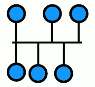{width=%}

- **Avantatges**: baix cost per emprar poc cablejat.
- **Desavantatges**: controlar les col·lisions. Xifrat per tal de mantenir la privacitat. Si falla un enllaç la xarxa deixa de funcionar completament.

#### Malla

Interconnexió total de tots els nodes

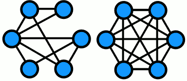{width=%}

- **Avantatges**: si una ruta falla es pot seleccionar altra alternativa.
- **Desavantatges**: més costós perquè fa falta més cablejat.

#### Estrela

Connecta tots els cables amb un punt central de concentració. Per regla general es tracta d'un *Hub* o un *Switch*.

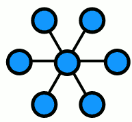{width=%}

- **Avantatges**: el node central realitza les tasques de distribució, conmutació i control per evitar col·lisions.
- **Desavantatges**: si el node central falla es queda tota la xarxa inutilitzada.

#### Arbre

Es connecten tots els nodes de forma jerarquitzada. Molt emprat en xarxes de telefonia on els enllaços intermedis són centraletes locals i regionals.

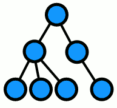{width=%}

- **Avantatges**: cost bastant optimitzat.
- **Desavantatges**: la fallada d'un node o enllaç deixa un conjunt de nodes incomunicats.

#### Anell

Tots els nodes estan connectats a una única via amb els seus dos extrems units.

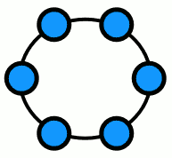{width=%}

- **Avantatges**: s'eviten col·lisions.
- **Desavantatges**: si fall un enllaç, la xarxa deixa de funcionar completament.

#### Mixta o irregular

És el que s'empra a la vida real quan la xarxa té certa envergadura. Es mesclen diverses topologies.

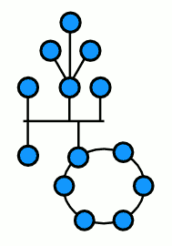{width=%}

- **Avantatges**: cada tram s'adapta a les seues característiques.
- **Desavantatges**: major complexitat de gestió del trànsit.

### Topologia lògica

La topologia lògica de la xarxa descriu la forma en que els equips es comuniquen dintre de la xarxa i pot ser:

- **Topologia de bus lògic**: cada equip envia les seues dades cap a tots els demés sense ningún tipus de filtre. Tots els nodes de la xarxa miren les dades que circulen per aquesta i decideixen si les dades són per a ells o no en funció de la adreça de destí.
- **Ús de testics (token)**: el testic va passant entre els diferents equips de la xarxa. Si el dispositiu que té el testic en eixe moment vol transmetre dades a través de la xarxa pot fer-ho i en cas contrari passa el testic al següent node.

## Classificació de xarxes

Les xarxes es poden classificar en funció de múltiples criteris:

- Extensió (localització geogràfica).
- La tecnologia de tranmissió.
- El nivell d'accés o seguretat.

### Extensió (localització geoogràfica)

- **Xarxes d'àrea local (LAN)**:
    - Una xarxa d'àea local té una ***reduïda extensió*** limitada, la seua tecnologia de transmissió sol ser difussió. La velocitat està entre els 10 a 1000Mbps. Les xarxes d'àrea local més exteses són *Ethernet* i *Token Ring*.
    - Solen tenir un retard molt baix a les transmissions i una taxa d'errors molt baixa. Solen ser xarxes privades i administrades per els seus propietaris.
- **Xarxes d'àrea metropolitana (MAN)**:
    - No superen una distància d'unes desenes de KM. En esència les MAN són una extensió de les LAN i com a tal empren tecnologies semblants. Les xarxes MAN de vegades s'empren per a interconnexió de xarxes LAN ubicades en diferents recintes geogràfics.
- **Xarxes d'àrea extesa (WAN)**:
    - S'empren sobre grans espais geogràfics, Poden cobrir distàncies de fins a milers de KM. Solen ser públiques i administrades per organismes o empreses nacionals. Gestionen taxes d'error altes. Les variants tecnològiques de les WAN són nombroses encara que es poden destacar aquelles basades en RDSI, FDDI, ATM FRAMERELAY.
- **Xarxes d'àrea personal (PAN)**:
    - Són xarxes amb una extensió d'uns pocs metres i interconnecten uns pocs equips (habitualment una habitació). Presenten una **configuració senzilla o automàtica**, **baix cost** i **actualment solen ser sense fil**.

### Tecnologia de transmissió

- Xarxes de difussió (broadcast o multipunt)
- Xarxes conmutades (punt a punt)
    - Conmutació de circuits
    - Conmutació de paquets

#### Xarxes de difussió (broadcast o multipunt)

- El **canal de transmissió és compartit** per tots els equips de la xarxa. Normalment, cada missatge transmés té un únic destinatari, l'adreça del qual apareix al missatge, però per conèixer si l'escollit és ell, cada equip de la xarxa ha d'escoltar cada missatge, analitzar l'adreça destí i comprovar si coincideix amb la pròpia, descartant-lo en cas contrari.

- Evidentment aquesta forma de treball provoca **problemes de privadesa**. L'única protecció efectiva a les xarxes de difussió és el xifrat de la informació. Aquest tipus de línies s'empren en xarxes menudes geogràficament localitzades. És important establir un mecanisme per evitar col·lisions.

#### Xarxes conmutades (punt a punt)

- **Conmutació de circuits**: consisteix en establir un **circuit físic diferenciat** de la resta entre emissor i receptor en cada procés de comunicació. Aquest tipus de conmutació és el que es produeix quan dues persones parlen per telèfon.
- **Conmutació de paquets**: es basa en l'**ús d'un conjunt de nodes** que s'encarreguen de l'emmagatzematge temporal i reenviament de la informació que reben d'altres nodes, L'usuari al transmetre, envia un bloc de dades denominat paquet. Aquest bloc té un format definit que recull, entre d'altres, qui és el destinatari de la informació. Una vegada dipositat a la xarxa, cada paquet és enviat d'un node a altre fins que aplega al seu punt de destí. La ruta per arribar al destí **no té perquè ser la mateixa per a tots els paquets**.

### Nivell d'accés o seguretat

- **Internet**: mètode d'interconnexió descentralitzada de xarxes d'equips implementat en un conjunt de protocols denominat TCP/IP i garanteix que les xarxes físiques heterogènies funcionen com una xarxa lògica única, d'alcaç mundial.
- **Intranet**: és tracta d'una xarxa dintre d'altra xarxa local (LAN) privada, empresarial o educativa que proporciona Internet.
- **Extranet**: xarxa privada virtual (VPN) que empra protocols d'Internet, de comunicació i probablement infraestructura pública de comunicació per tal de compartir de manera segura part de la informació o operació pròpia d'una organització amb proveïdors, compradors, socis, clients o qualsevol altre negoci o organització.

## Elements de la xarxa

A una xarxa podem distingir els següents elements:

- El sistema de cablejat i radioelèctric.
- Dispositius de xarxa
- Nodes de xarxa
- Software de xarxa

### Sistema de cablejat i radiolèctric

Condueixen la senyal per transportar la informació. El sistema de cablejat està format pel cable (normalment coure o fibra òptica) i els seus connectors. Cada tipus de cablejat porta el seu propi sistema de connectorització.

### Els dispositius de xarxa

Interconnecten màquines i serveis. Poden ser mòdems, routers, proxies, repetidors...

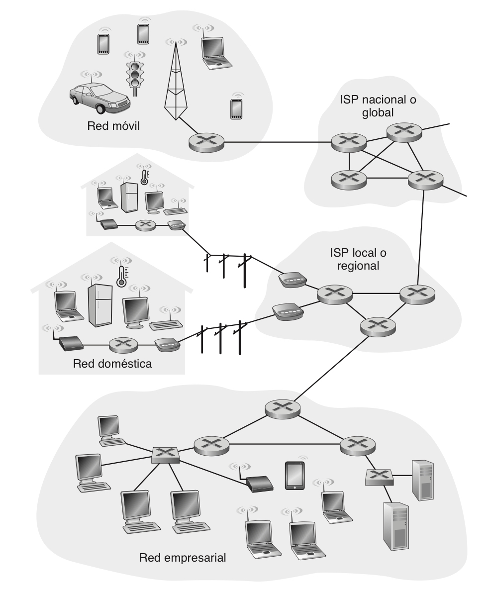{width=66%}

### Nodes de la xarxa

Els nodes poden estar connectats a la xarxa mitjançant cable o sense fil. Cada node requerirà al menys d'una interfícies de xarxa per poder connectar-se al cable o antena.

### Software de xarxa

- Aplicacions: gestors de xarxa (aplicacions que empren els diferents nivells de xarxa), els recopiladors d'estadístiques, analitzadors de congestió.
- Sistemes operatius.

## Arquitectura de la xarxa

De igual forma que els sistemes operatius s'encarreguen de gestionar eficientment els recursos d'un equip, el software de xarxa realitza la mateixa tasca de cara als recursos físics de la xarxa (hardware).

Les xarxes de comunicacions han de poder resoldre problemes d'adreçament, accés al medi, sincronització, format dels missatges, encaminament, control de fluxe, control d'errors i multiplexació.

### Adreçament

Una xarxa té múltiples equips i és necessari que cada equip tinga una **adreça diferenciada** a la xarxa. Al mateix temps, cada equip pot tenir diversos processor en marxa... Es necessita un mecanisme per tal que un procés d'un equip especifique amb quin procés (**port**) d'altre equip vol connectar-se.

### Encaminament

Si la xarxa permet arribar a un destí per diverses rutes, es necessita un mecanisme que determine quina és la millor ruta en un moment donat.

### Accés al medi

Si existeix un mecanisme de comunicació de difussió, ha d'existir un mecanisme per controlar l'ordre de transmissió i evitar col·lisions.

### Control de fluxe

Un emissor molt ràpid pot saturar/desbordar a un receptor. Hem de contar amb un mecanisme per controlar aquest fluxe.

### Sincronització

El receptor ha de poder determinar quan una senyal comença a arribar i quan acabe, així com la durada de cada element de la senyal. En algunes xarxes, les dades arriben desordenades. Hem de contar amb un mecanisme que permeta reordenar les dades en el destí.

### Control d'errors

A totes les xarxes de comunicacions quen transmetem hi ha un xicotet percentatge d'errors. Hem de contar amb mecanismes que permeten la seua **detecció** i **correcció**.

### Format dels missatges

Ambdues parts han d'estar d'acord amb el format de les dades que es transmeten.

### Multiplexació

Si compartim un medi de transmissió, hem d'assegurar que si hi han més d'una comunicació al mateix temps que no s'interferisquen.

### Arquitectura per capes

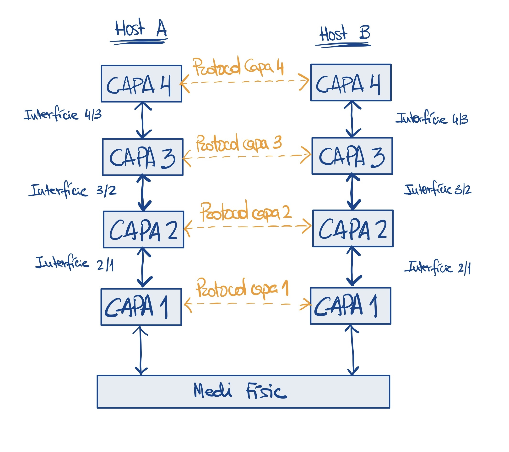{width=66%}

És molt més senzill descomposar els problemes de la xarxa si la organitzem en **capes o nivells** i que cada capa s'encarregue d'una funcionalitat.

**Cada capa ofereix uns serveis a les capes superiors**, alliberant-les de coneixement detallat de com es realitzen aqueixos serveis.

Al mateix temps, **la capa *n* en una màquina conversa amb la capa *n* de l'altra màquina**.

Les regles i convencions emprades en aquesta cnversació es coneixen conjuntament com **protocol de la capa *n***.

Quan un sistema vol enviar un missatge a altre, la informació ha de "baixar" fins al medi físic i a través d'aquest arribar al sistema remot. Conforme va descendint es produeixen transformacions, per exemple, addició de camps de capçalera, fragmentació de paquets en altres més menuts... Totes aquestes transformacions són reversibles i en el sistema remot es realitzen en sentit invers fins que un missatge igual que l'original és depositat al nivell de destí.

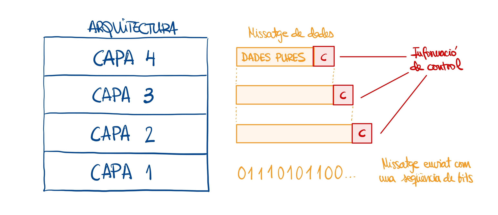{width=66%}

Entre cada parell de capes adjacents hi ha una interfície, **que defineix els serveis i operacions primitives que la capa inferior ofereix a la superior**. El disseny clar i net d'una interfície, a més a més de minimitzar la quantitat d'informació que deu passar-se entre capes, fa més simple la substitució d'una capa per altra completament diferent.

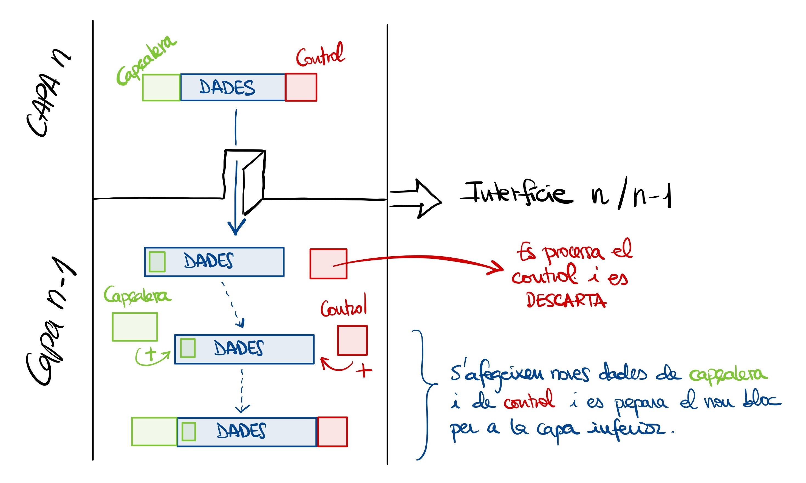{width=66%}

#### El model ISO-OSI

!!!info "Un model de referència"
    Al 1977, la Organització Internacional de Normes (*ISO, International Standard Organization*) va crear un subcomité per desenvolupar estàndards de comunicació de dades que permeteren la interoperabilitat entre productes de distints fabricants. Despés de diverses investigacions van elaborar un model de referencia OSI (*Open System Interconection*).

    **OSI** no és realment una arquitectura de xarxa, sino un **model de referència**, és a dir, un model teòric que **cimenta les bases** del que hauria de ser la "arquitectura de xarxa ideal", però és massa purista i aparegué tard.

El model proposat per OSI està estructurat en **7 capes** o nivells, casadcun d'ells s'encarrega d'oferir una sèrie de serveis a la capa superior i de tornar resultats a la capa inferior.

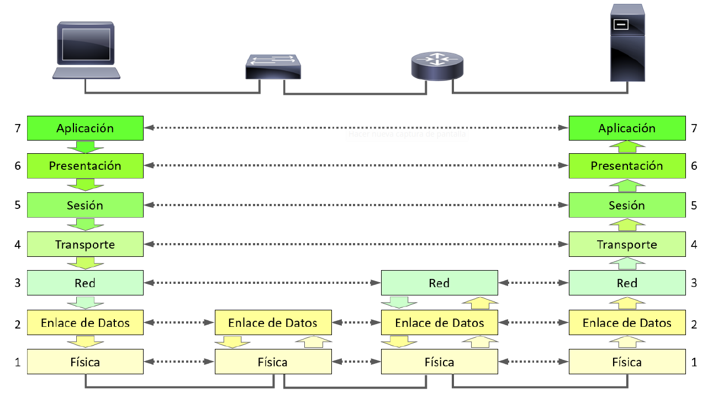{width=66%}

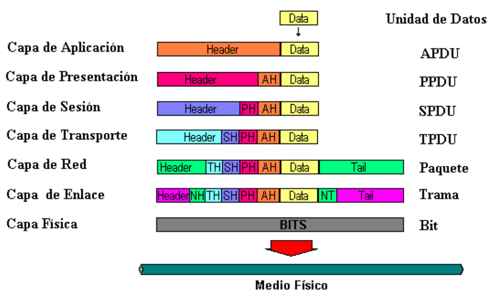{width=66%}

##### Nivell físic (I)

La capa física s'encarrega de definir les característiques **mecàniques, elèctriques, funcionales i de procediment** per poder establir i alliberar connexions entre dos equips de xarxa.

És la capa de nivell més baix, s'encarrega de les **tranmissions dels bits** i defineix paràmetres com: durada dels polsos elèctrics, nombre de Volts (V) de la senyal, la modulació, el tipus de cablejat...

##### Nivell d'enllaç (II)

La tasca principal d'aquesta capa és **establir una línia de comunicació lliure d'errors** que puga ser emprada per la capa inmediatament superior (xarxa).

Hem vist que el nivell físic opera amb bits. La capa d'enllaç s'encarrega de **fraccionar el missatge** en blocs de dades de nivell 2 anomenats **trames o frames**.

L'emissor envia les trames en seqüència per la línia de transmissió i espera les trames de confirmació que generarà la capa d'enllaç del receptor.

Altra funció de la capa d'enllaç és **assegurar el fluxe de dades entre emissors ràpids i receptors lents** o al revés.

A més a més, també s'ocuparà dels **errors** que es produisquen (eliminar trames defectuoses, solicitar retransmissió, descartar duplicades...).

##### Nivell de xarxa (III)

La principal funció de la capa 3 és l'**encaminament**, és a dir, com escollir la ruta més adequada perquè el bloc de dades de nivell de xarxa, anomenat **paquet**, arribe al seu destí. Cada destí està identificat unequívocament a la subxarxa per una **adreça**.

Altra funció important és la del tractament de la **congestió**. Quan hi ha sobrecàrrega de paquets a la xarxa, s'obstrueixen uns a altres generant colls de botella als punts més sensibles. Un bon sistema de gestió de xarxa evitarà o paliarà aquests problemes de congestió desviant paquets cap a altres rutes inicialment no previstes.

##### Nivell de transport (IV)

Capa de transició entre els nivells de xarxa i els nivells orientats a les aplicacions (5, 6 i 7).

Els paquets poden haver prés rutes distintes i arribar als seus destins **desordenats**. És funcio de la capa de transport del receptor **assegurar que les dades són les mateixes que envià la capa de transport de l'emissor**, és a dir, no s'han produït **errors** i **ordenar-los** en el cas que arriben desordenats.

##### Nivell de sessió (V)

Permet el **diàleg** entre emissor i receptor **establint una sessió** que portarà un transport de dades ordinari (capa de transport) però **amb possibilitat de restaurar-la** en cas que es produisquen errors a la tranmissió.

Un exemple típic és la descàrrega d'un fitxer que es talla poc abans de finalitzar. Si a l'inici de la descàrrega s'establí una sessió, podrà ser resincronitzada, de tal manera que a la següent connexió es transmeten dades a partir de l'últim bloc transmés sense error.

##### Nivell de presentació (VI)

Aquesta capa **s'ocupa de la sintaxi i de la semàntica** de la informació que es preten transmetre, és a dir, **investiga el contingut informatiu de les dades perquè emissor i receptor puguen "entendre's"**.

Per exemple: suposem una transmissió de text entre un emissor que empra codificació ASCII per a la representació d'informació alfanumérica i un receptor que empra codificació EBCDIC. Si les dades son enviades i prou, el receptor no serà capaç d'imyterpretar-les perquè estan "parlant llenguates distints". Necessiten un servei de conversió i interpretació que és el que fa la capa de presentació.

Altra funció de la capa de presentació pot er la de **comprimir i/o encriptar les dades**.

##### Nivell d'aplicació (VII)

És la capa superior de la jerarquia i és la capa amb la qual es comuniquen les aplicacions.

S'encarrega d'oferir una **inferfície comú a través de la qual es comunicaran les aplicacions**, sense tenir en compte si l'aplicació orige i la aplicació destí estan a la mateixa màquina o en màquines diferents.

{width=66%}

