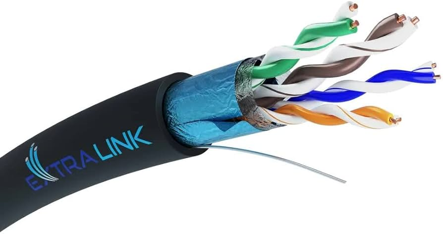
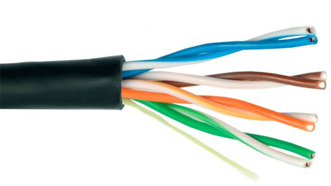
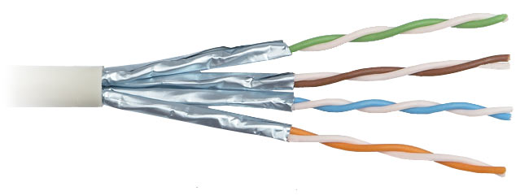
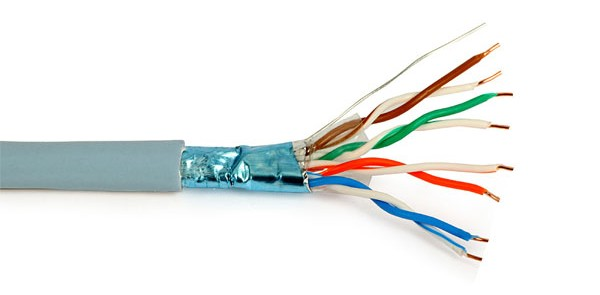
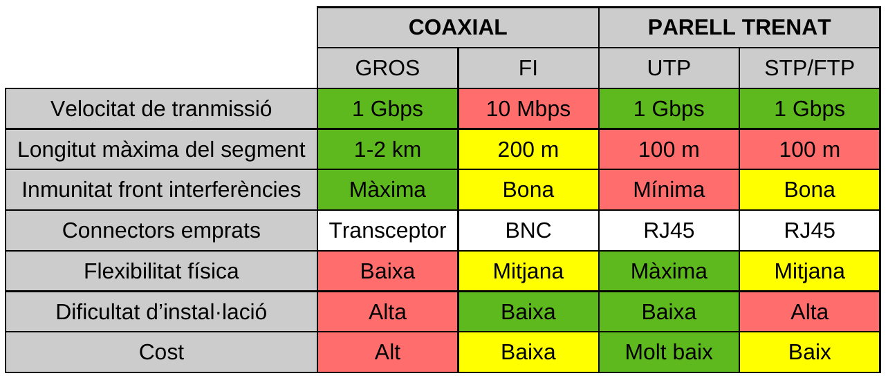
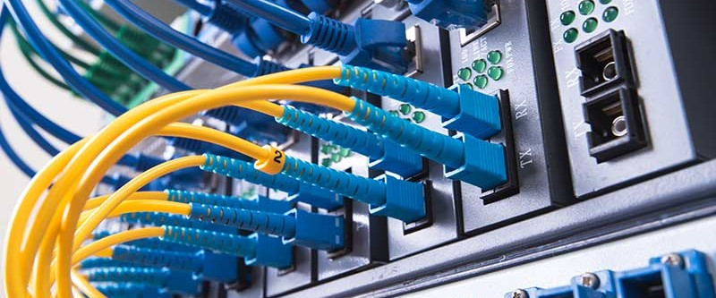
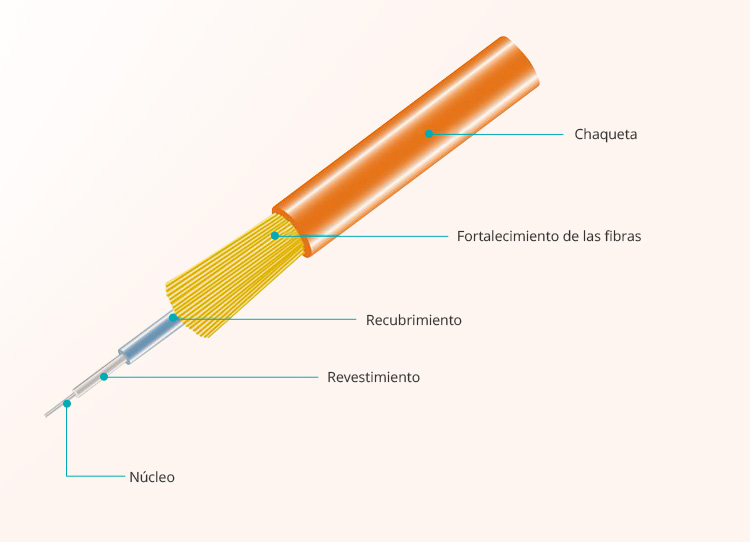
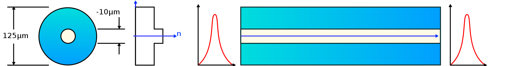
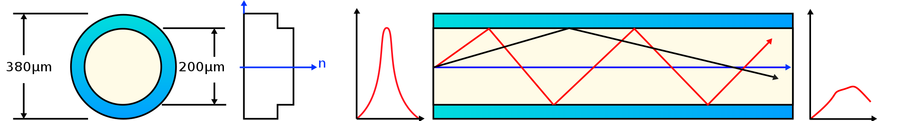
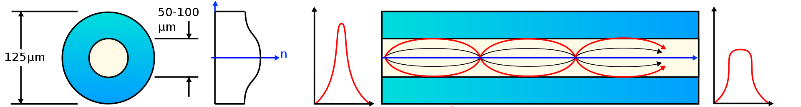

# UD2. Instal·lació física d'una xarxa (I). Medis de transmissió

## Introducció

El **medi de transmissió** és el suport físic que facilita el transport de la informació i suposa una part fonamental en la comunicació de les dades.

Normalment es realitza la tranmissió emprant cablejat de xarxa, però també es pot fer sense fil, de manera inalàmbrica.

!!!warning "A tenir en compte..."
    - La **inversió estimada per a cables** en una instal.lació sol ser **inferior al 10%** de cost total.

    - El **70% dels errors produits** en una xarxa es deuen a defectes de **cablejat**.

    Per tant, **no hem d'escatimar massa** les inversiona en cablejat estructurat.

La qualitat d'una tranmissió depen de les propietats del material:

- **Propietats físiques**: son les propietats generals que permeten descriure un material. Per exemple: pes, color, temperatura de fusió, coeficient de dilatació...
- **Propietats mecàniques**: descriuen la resistència que presenta un material quan se'l somet a forces externes. Per exemple: elasticitat, plasticitat, duresa, fragilitat...
- **Popietats elèctriques**: son les que determinen el comportament d'un determinat material al passar per ell el corrent elèctric. Trobem materials aillants, conductors i semiconductors.

Finalment, cal tenir el compte el fenòmen de l'**atenuació**, que és la pèrdua de potència soferta per una senyal al transitar per qualsevol medi de tranmissió.

## Tipus de cablejat de xarxa

- **Cablejat metàlic**: transmeten la informació mitjançant **impulsos elèctrics**.
  - **Parell trenat** (*TP = Twisted Pair*)
  - **Coaxial**
- **Cables de fibra òptica**: transmeten la informació mitjançat **rajos de llum**.

### Cable de parell trenat

Està compost per:

- Una o més parelles de filaments metàlics aïllats (normalment de coure).
- Parelles trenades entre sí.
- Recobriment mitjançant funda protectora.

{width=50%}

Constitueixen el mode més **simple i econòmic** de tots els medis de transmissió.

Es tracta d'un cable molt **susceptible a interferències electromagnètiques (EM I)** i per tal de reduir-les tenim dues actuacions:

- **Trenar els parells** de mode que les intensitats de transmissió i recepció anulen perturbacions electromagnètiques.
- **Apantallar** els cables, és a dir, emprar un protector que els aïlle de les interferències.

!!!note "Efecte de Crosstalk"
    El *crosstalk*, o diafonía, és un fenomen en què els senyals elèctrics transmesos en un conductor afecten involuntàriament conductors adjacents. Això pot provocar interferències i distorsió en les comunicacions, especialment en cables o línies elèctriques pròximes.

    El *crosstalk* pot ser causat per diversos factors, com ara la proximitat física dels conductors, la capacità i inductància entre ells, o problemes d'apantallament inadequat. **En entorns de xarxa, el crosstalk pot conduir a errors de transmissió, pèrdua de senyal i reducció de la qualitat de la comunicació**.

    Per mitigar els efectes del *crosstalk*, es poden prendre mesures com utilitzar cables **apantallats**, mantenir distàncies adequades entre conductors, o implementar tècniques de cancel·lació de diafonia.

#### Cable UTP

***UTP (Unshielded Twisted Pair)*** significa *parell trenat sense pantalla/escut*.

Les seues principals característiques són:

- És sensible a interferències.
- Ofereix un gran ample de banda.
- És simple i barat.
- És flexible i fàcil d'instal·lar.
- Connecta habitualment estacions de treball, terminals i dispossitius.

Tot açò fa que siga **el cable més emprat per a comunicar xarxes d'ordinadors**.

{width=50%}

#### Cable STP

***STP (Shielded Twisted Pair)*** significa *parell trenat apantallat*.

Es tracta d'un cable apantallat, molt similar a l'UTP però amb un recobriment per a cada parella de cables (normalment metàlic). El recobriment ha de conectar-se a la terra de la instal·lació per a les derivacions elèctriques.

L'esmentat recobriment **redueix el soroll** exterior del cable produït per interferències electromagnètiques (EMI) i de radiofreqüència (RFI). També redueix el soroll elèctric dins del cable. Al tractar-se d'un cable més protegit pot treballar amb distàncies i freq¨`encies majors.

{width=66%}

#### Cable FTP

***FTP (Foiled Twisted Pair)*** significa *parell trenat amb pantalla global*. És semblant al STP, però el recobriment és exterior i global.

{width=66%}

!!! info "Els cables **STP i FTP** tenen alguns desavantatges"

    - Falta de flexibilitat
    - Incòmodes d'instal·lar
    - Més cars que el cable UTP

    Per aquestes raons, normalment sols s'empren en línies troncals o en llocs molt exposats a interferències electromagnètiques.

#### Classificació de cables de parell trenat

Dintre dels **parells trenats** podem distingir **2 classificacions**:

- **Les catergories**: cada categoria especifica unes característiques elèctriques per al cable: atenuació, capacitat de la linia, freqüència de treball màxima...
- **Les classes**: cada classe especifica les distàncies permeses, l'ample de banda aconseguit i les aplicacions per a les quals és útil en funció d'aquestes característiques.

| **Categoria** | **Freqüència màxima** | **Velocitat màxima** |               **Ús**              |
|:-------------:|:---------------------:|:--------------------:|:---------------------------------:|
|     Cat.3     |         16 Mhz        |        10 Mbps       |              Obsolet              |
|     Cat.4     |         20 Mhz        |        20 Mbps       |              Obsolet              |
|     Cat.5     |        100 Mhz        |       100 Mbps       |        Xarxes Fast Ethernet       |
|     Cat.5e    |     [100-350] Mhz     |        1 Gbps        |    Xarxes Fast/Gigabit Ethernet   |
|     Cat.6     |        250 Mhz        |        1 Gbps        |      Xarxes Gigabit Ethernet      |
|     Cat.7     |        600 Mhz        |        10 Gbps       | Xarxes Gigabit Ethernet i futures |

### Cable coaxial

Degut al seu tipus d'apantallament és menys susceptible a interferències (EMI) que el parell trenat.

Està compost per una malla de coure recobert d'una capa aïllant flexible. També pot estar fet d'alumini recobert d'estany (més econòmic).

Permet cobrir majors distàncies (entre 500 m i varios km) i connectar un major nombre d'estacions en una línia compartida.

Degut a la seua duresa i poca flexibilitat ha deixat d'emprar-se en instal·lacions de cablejat estructurat, però continua utilitzant-se en la distribució de TV per cable.

{width=50%}

- **AVANTATGES**:
    - Arriba a majors distàncies que el cable UTP o STP (500m vs 100m).
    - Més econòmic que la fibra òptica.
    - Major blindatge que el cable UTP.

- **DESAVANTATGES**:
    - Instal·lació més costosa.
    - Major dimensió per la seua grossor.
    - Més rígid.
    - És necessària una connexió elèctrica sòlida en els extrems. En cas contrari, apareix soroll elèctric que interfereix en la transmissió de la senyal. Per eixa raó, no és suportat pels estàndards actuals.

{width=75%}

### Fibra òptica

La fibra òptica permet la **trensmissió de senyals lluminoses**. Sol ser de vidre o altres materials plàstics.

{width=66%}

Al no emprar corrent elèctrica per a la transmissió és totalment **insensible a les interferències electromagnètiques (EMI)**.

Un cable de fibra òptica consta de:

- un nucli fibrós a través del qual viatja la senyal lluminosa.
- un revestiment que impedeix que es filtre la llum.
- una coberta que protegeix i aïlla el cable.

{width=66%}

Com a **font del senyal** sol emprar-se:

- Làser
- Diodes LED

#### Carcaterístiques generals de la fibra òptica

- Cobreix grans distàncies (km).
- Gran ample de banda: superior als 10 Gbps. Un sol cable de fibra òptica pot transportar desenes de milers de trucades telefòniques.
- Taxa d'error molt baixa.
- Sol instal·lar-se en grups, en forma de mangueres, amb un nucli metàlic que serveix de suport i protecció.
- Els principals inconvenients de la fibra són la fragilitat i la dificultat per a realitzar una bona connexió de diverses fibres. Un correcte connexionat evita reflexions de la senyal i una milloria de la qualitat de la transmissió.
- Actualment s'utilitzen dos tipus de fibres òptiques:
    - Fibres mono-mode
    - Fibres multi-mode

#### Fibra òptica mono-mode

Sols es propaga un mode de llum.

S'aconseguiex reduïnt el diàmetre de la fibra fins un tamany que sols permet un mode de propagació.

La seua transmissió és paral·lela a l'eix de la fibra. Grans distàncies (300 km) i elevades taxes de transferència (desenes de Gbps).

{width=75%}

#### Fibra òptica multi-mode

Els rajos de llum poden circular per més d'un mode o camí. Se suposa que no arriben tots a la vegada.

Pot tenir més de mil modes de propagació de llum. Les fibres multi-mode s'utilitzen comunment en aplicacions de curta distància, menors a 1 km; és simple de dissenyar i econòmic.

Tenim dos alternatives:

- **Índex escalonat**: té un índex de refracció constant en tota la secció cilíndrica.

{width=75%}

- **Índex gradual**: l'índex de refracció a l'interior del nucli no és únic i decreix quan es desplaça del nucli fins la coberta.

{width=75%}

## Transmissions sense fil

Les tecnologies sense fil empren **ones electromagnètiques** per transportar la informació entre els dispossitius.

Alguns tipus d'ones electromagnètiques no son adequades per transportar dades. Altres, estan regulades èr governs. Algunes àrees de l'espectre s'han reservat per a ús públic sense tindre que demanar permissos.

L'**espectre electromagnètic** inclou **bandes de transmissió de radio i televisió, llum visible, rajos X i rajos gamma**. Cadaascun d'aquests elements té un rang específic de longitut d'ona.

{width=75%}

Les longituts d'ona més emprades per a comunicacions sense fil públiques son la **infraroja i la part de radiofreqüència (RF)**:

- Ona curta (freqüències de MHz): emprades en **radio i TV**.
- Microones (freqüències de GHz): emprades en **telefonia mòbil**.
- Transmissions via satèlit: emprades en **geolocalització** amb freqüències de fins a 1000 GHz.

Els **avantatges** que aporten les comunicacions sense fils a les **LAN** són:

- Comoditat
- Facilitat de configuració
- Flexibilitat

Tant l'emissor com el receptor han de tenir una **antena** que els permeta **enviar/rebre** la senyal.

Com a norma, a major freqüència, major velocitat. De la mateixa manera, a major velocitat, major atenuació.

Els **sistemes sense fils** emprats **en xarxes informàtiques** són:

- Bluetooth
- Infrarrojos
- Wifi
- WiMax

### Infrarrojos (IR)

- Transmeten senyals de dades mitjançant diodes d'**emissió de llum** (LED o làser). La informació **no pot viatjar a través d'obstacles**.
- Emprat per connectar i tranportar dades entre dispossitius com **PDA i PCs**. Utilitza un **port de comunicacions especial anomenat irDA**.

{width=50%}

### Radiofreqüència (RF)

Algunes bandes de radiofreqüències s'han reservat per a l'ús de dispossitius sense llicència, com les **LAN sense fil, telèfons sense fil, perifèrics d'ordinadors**...

- Les ones **poden atravessar parets i altres obstacles** i per tant tenen major cobertura que els IR.
- Per a **LAN sense fil existeixen diferents normes/estàndards**. Els més coneguts són:
    - IEEE 802.11b
    - IEEE 802.11a
    - IEEE 802.11g
    - IEEE 802.11n
    - IEEE 802.11ac
    - IEEE 802.11ax
- Altres tipus de comunicació per radiofreqüència son el ***bluetooth*** i les **microones**.

#### Bluetooth (BT)

Especificació per a xarxes sense fil d'àrea personal (WPAN) que possibilita la transmissió de veu i dades entre diferents dispossitius mitjançant un enllaç per radiofreqüència en la banda dels **2'4GHz**.

Aquesta norma facilita les comunicacions entre equips mòbils, elimina el cablejat i connectors i ofereix la possibilitat de crear xicotetes xarxes sense fil i facilitar la sincronització de dades entre equips personals.

{width=50%}

#### Microones

Es tracta d'un tipus eficaç de transmissió de dades sense fils.

- **Terrestre**: empra dues torres de microones amb **camp de visió clar** entre elles; per tant, no han d'ahver-hi obstacles per interrompre l'esmentat camp visual. La freqüència de transmissió de dades dels sistemes terrestres és de 4 GHz a 23 GHz, mentre que les **velocitats** soles estar entre **1Mbps i 10 Mbps**.
- **Satèlit**: giren a vora 40.000 km sobre La Terra. Les estacions terrestres envien i reben senyals de dades cap i desde el satètil amb freqüències que oscilen entre 11 GHz i 14 GHz, amb velocitats de desenes de Mbps.

{width=50%}

#### LAN sense fils (WiFi)

Les transmissions en LANs sense fil arriben a velocitats de transmissió moderades, encara que amb l'aparcició del 802.11n i posteriors s'arriben a "altes" velocitats (>300 Mbps). Les distintes versions de Wifi que existeixen estan descrites a la normativa [IEEE 802.11](https://es.wikipedia.org/wiki/IEEE_802.11#:~:text=802.11n%20es%20la%20forma,datos%20de%20hasta%20600%20Mbps.). A la següent taula podem veure les principals característiques de les variants que s'utilitzen actualment.

| **Norma IEEE** | **Nom WIFI** |  **Freq.** |  **Velocitat**  | **Alcanç** |                  **Característiques**                  |
|:--------------:|:------------:|:----------:|:---------------:|:----------:|:------------------------------------------------------:|
|     802.11b    |     Wifi1    |   2.4GHz   |      11Mbps     |   30-90m   |                    Estàndar original                   |
|     802.11a    |     Wifi2    |    5GHz    |      54Mbps     |   10-25m   |     No compatible amb b,g,n. Gestió d'energia roïn     |
|     802.11g    |     Wifi3    |   2.4GHz   |      54Mbps     |   30-45m   |           Més ràpid i compatible amb 802.11b           |
|     802.11n    |     Wifi4    |  2.4/5GHz  |   300-600Mbps   |   30-60m   |            Més ràpid i compatible amb b i g            |
|    802.11ac    |     Wifi5    |    5GHz    | 800Mbps-1.6Gbps |   30-45m   |    Utilitza components que consumeixen menys energia   |
|    802.11ax    |     Wifi6    | 2.4/5/6GHz |      5Gbps      |   30-60m   | Millor gestió de dispossitius amb xarxa congestionada. |

#### WIMAX

Les transmissions en **WIMAX** segueixen la normativa IEEE 802.16. Semblant al WIFI però amb cobertures majors a canvi de velocitats menors.

|                | **WIFI (802.11)** | **WIMAX (802.16)** |
|:--------------:|:-----------------:|:------------------:|
|   **Alcanç**   |        100m       |        50km        |
|  **Cobertura** |      Interior     |      Exterior      |
| **Freqüència** |   2.4GHz a 6GHz   |        20Mhz       |
|  **Velocitat** |       1Gbps       |       75Mbps       |

