# UD3. Instal·lació física d'una xarxa (II). Dispositius de connexió

## Connectors per a xarxes

La **funció** dels connectors és introduir el senyal de l'emissor al cable i adequar el senyal del cable a l'interfície del receptor.

Freqüentment, els connectors d'una mateixa familia es dupliquen en forma de ***mascle i femella***, que han d'acoplar-se mecànicament a la instal·lació.

### Connector RJ11

- Emprat majorment per enllaçar xarxes de **telefonia**.
- Dimensions reduïdes i amb 2, 4 o 6 contactes.
- És el connector més difós globalment per a la connexió de dispositius telefònics convencionales, on es solen emprar generalment tan sols els dos pins centrals per a una linia simple.

<center>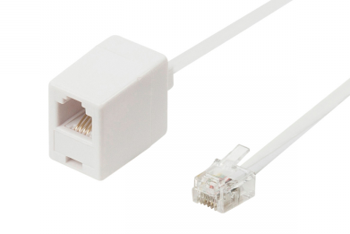{width=33%}</center>

### Connector RJ45

- És el connector més emprat per connectar **xarxes de cablejat estructurat**. Sol emprar cables **UTP** o **STP**.
- Està format per **8 pins** als quals van connectats cadascun dels cables del parell trenat.

<center>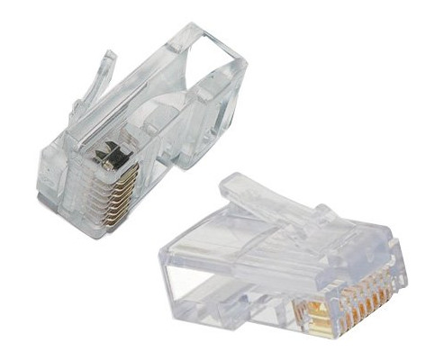{width=33%}</center>

### Connector BNC

- Emprat amb **cables coaxials** a les primeres ***ethernet***, durant els anys 80.
- Consisteix en un connector de tipus mascle en cada extrem del cable. Aquest connector tenen un centre circular connectat al conductor del cable central i un tub metàlic connectat a la part exterior del cable. Un anell que rota a la part exterior assegura el cable mitjançant un mecanisme de bayoneta i permet la connexió a qualsevol connector BNC de tipus femella.

<center>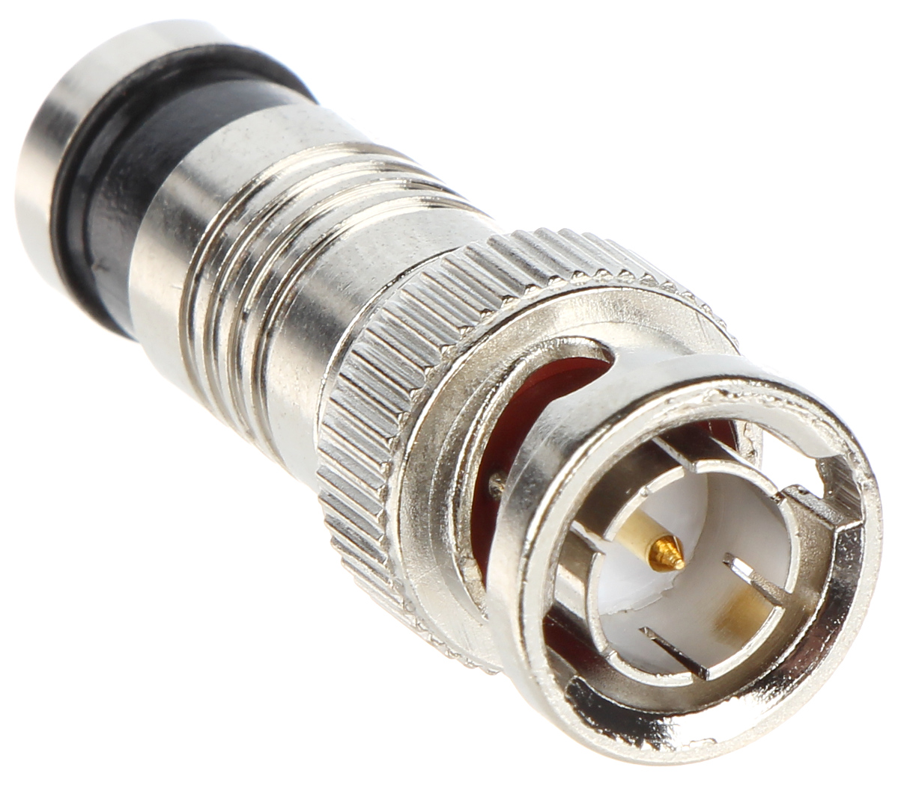{width=33%}</center>

### Connector DB9

- Originalment DE-9. S'empra princpipalment per **connexions en serie** perquè permet una **transmissió asínrona de dades** segons els que estableix la normativa ***RS-232***.
- Actualment poc emprats, tan sols en alguns dispossitius específics.

<center>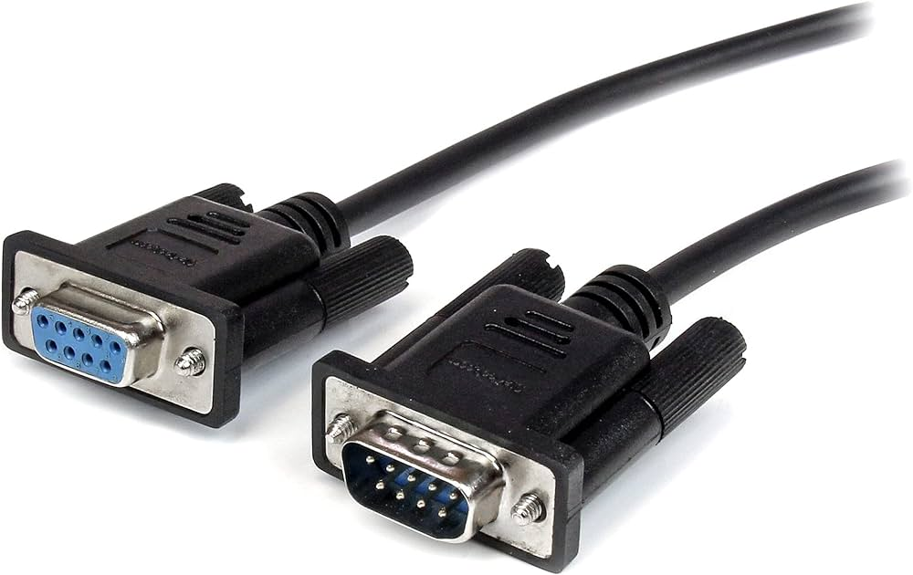{width=66%}</center>

### Connector DB25

- Connector analògic de **25 pins**.
- S'emprava molt per connectar impresores i per aquest motiu se li coneix com **el port de la impresora (LTP)**.
- S'empra per a connexions en serie i en paral·lel, per aquesta raó, generalment, els ports de serie tenen connectors mascles i els ports paral·lels, femella.

<center>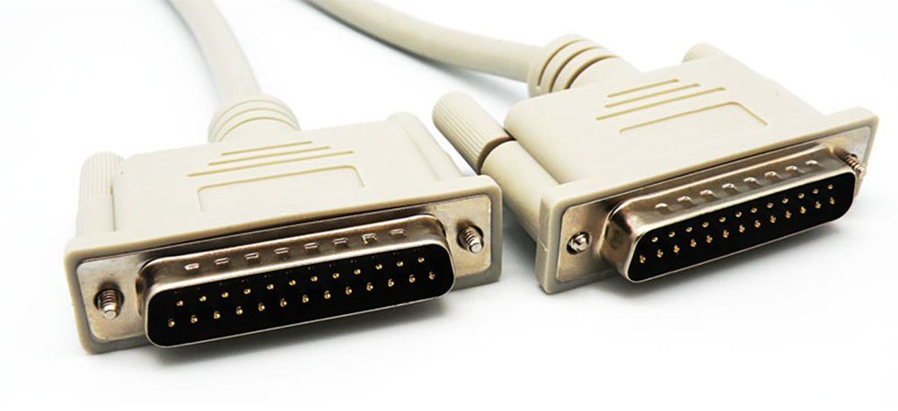{width=66%}</center>

### Connector ST (Fibra)

- Ha sigut durant molt de temps el més emprat per finalitzar **fibres òptiques multi-mode (FMM)**, avui en dia està en desús, no obstant segueix present en moltes instal·lacions.
- Presenta un sistem d'anclatge per ***bayoneta*** que el converteix en un model molt **resistent a les vibracions** i el feia especialment indicat en entorns exigents.

<center>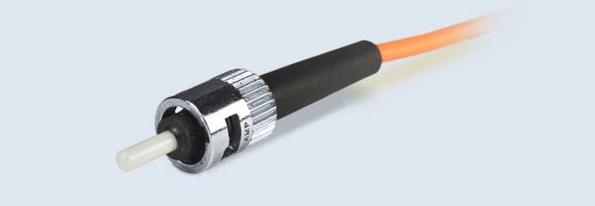{width=66%}</center>

### Connector SC (Fibra)

- S'empra habitualment en instal·lacions de fibra òptica. Sol gastar-se en ***Switchs Gigabit Ethernet***.
- La connexió de la fibra al connector requereix d'un poliment de la fibra i la aliniació de la fibra amb el connector.
- Aquests connectors han anat substituint als connectors ST en cablejats estructurats, fonamentalment per ser **més fàcils de connectar**.

<center>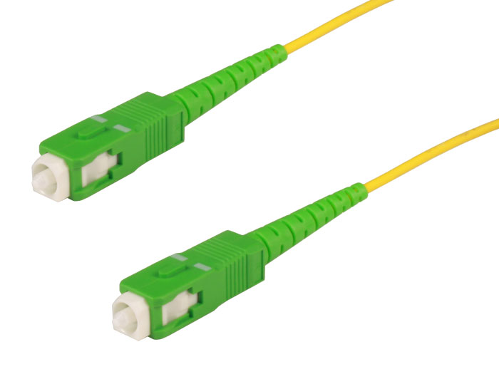{width=66%}</center>

## Ferramentes

La creació de les connexions de la xarxa ha de realitzar-se amb molta cura. La major part dels problemes de les xarxes d'àrea local estan relacionats amb problemes de cablejat o als connectors.

Les ferramentes que gastarem, dependran del tipus de cable i connector utilitzat, però quan parlem de cablejat estructurat són molt comuns:

- **Grimpadora**
- **Alicates i ferramentes de tall**
- **Pela-cables**
- **Ferramentes d'impacte**
- **Comprovador de cables**

<center>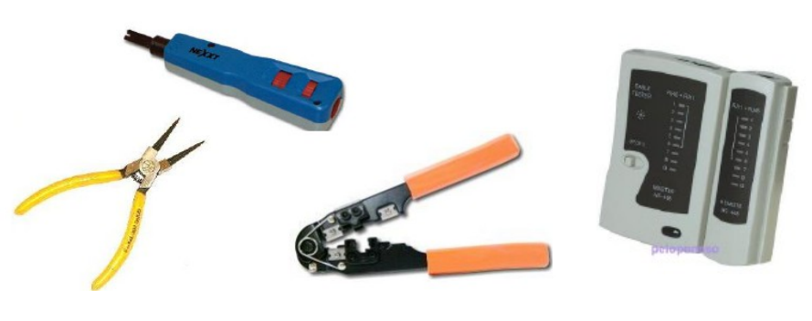{width=75%}</center>

ALtres ferramentes útils son:

- **Brides**: elements plàstics que amarren els cables entre sí als armaris o canaletes.
- **Etiquetes**: sisteme d'informació que s'adjunta a cada cable per tal de tenir-lo identificat en tot moment. Es poden fer servir etiquetes clàssiques o generades amb una **etiquetadora**.
- **Macarrons termoretràctils**: Cables buits contruits amb un material plàstic que s'arrupix quan se li aplica calor per tal de reforçar la unió del cable amb el connector.

## La targeta de xarxa

Es tracta d'un xicotet circuit imprés que, habitualment, es coloca en un slot d'expansió de la placa base de l'ordinador; existeixen externes en format USB. També es coneixen com *Adaptador de xarxa* o *NIC (Network Interface Computer*.)

Treballa al **nivell 2** (enllaç) del model OSI.

<center>{width=66%}</center>

<center>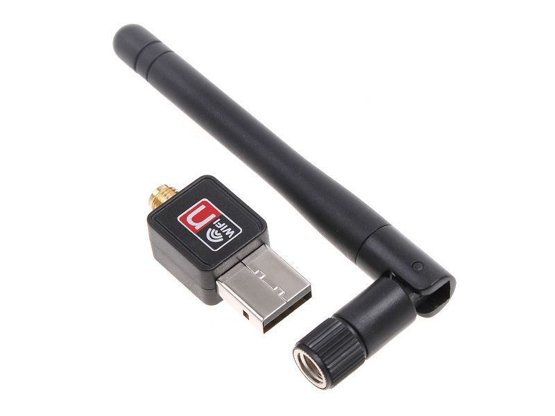{width=66%}</center>

Cada targeta de xarxa porta un nom codificat únic, denominat adreça de control d'accés al medi (***MAC***) i és únic en el mòn.

Aquesta adreça és molt important degut a que identifica perfectament i de forma única a l'ordinador orige i destí.

Factors a tenir en compte al moment de triar una targeta de xarxa:

- **Protocols**:
    - Ethernet
    - Token Ring
    - FDDI
- **Tipus de medi**:
    - Cable de parell trenat (RJ45)
    - Cable coaxial (BNC)
    - Sense fil
    - Fibra Òptica
- **Connexions amb l'ordinador**:
    - Bus PCI
    - Bus PCI Express
    - USB
- **Velocitat màxima**:
    - 100 Mbps
    - 1000 Mbps
    - 10 Gbps

### Configuració de l'adaptador de xarxa

Cada Sistema Operatiu té una forma d'accedir als adaptadors de xarxa. Quan accedeixes a les seues propietats pots consultar l'adreça IP, la porta d'enllaç o els DNS.

En sistemes **Linux**, es pot accedir a molta d'aquesta informació mitjançant el comandament ```ip a``` llançat en un terminal.

<center>{width=100%}</center>

Per altra banda, en sistemes **Windows**, aquesta informació està disponible mitjançant el comandament ```ipconfig /all``` del terminal de Windows (Símbol del sistema)

## Model TCP/IP

???+ question "Per què el model OSI no tingué èxit i el model TCP/IP sí?"

    - El **model OSI** fou creat abans d'implementar la programació de cadascuna de les capes. Al portar-lo a la pràctica no tingué la repercusió que s'esperava perquè era un **model molt complexe**, amb capes de distinta "grossor" i algunes funcionalitats mal situades, per exemple, el xifrat.
    - El **model TCP/IP** és un model **més pràctic**. Primerament es vàren dissenyar els protocols i a posteriori s'integraren per capes a l'arquitectura.
    - El **model TCP/IP** és molt **més simple**, de fet redueix les capes de 7 a 4.

El model TCP/IP és l'arquitectura en la qual es basa Internet. És un model de 4 capes i reb el nom dels seus protocols majoritaris:

- ***TCP (Tranmission Control Protocol)***: treballa en el nivell 4 de OSI i per tant realitza tasques de **transport**.
- ***IP (Internet Protocol)***: treballa al nivell 3 del model OSI i per tant realitza tasques d'**encaminament**.

<center>{width=66%}</center>

Les capes del model TCP/IP són:

- **Subxarxa (Accés a la xarxa)**: proporciona la tramissió de les dades independentment de la xarxa que estiga configurada. És la capa encarregada de convertir el senyal analògic/digital. També realitza el ***control de fluxe*** per evitar que els equips ràpids colapsen als més lents.
- **Interxarxa (Internet)**: És la capa més important donat que és l'encarregada de transmetre **datagrames** emprant com adreçament l'**adreça IP**. Durant la tranmissió pot passar per distintes xarxes diferents i les dades poden arribar al destí desordenades.
- **Transport**: S'encarrega d'establir una comunicació entre orige i destí. Introdueix el concepte de **port** per comunicar diverses aplicacions d'una mateixa màquina. S'encarrega de dividir els **segments** de dades que li arriben de la csps d'aplicació, **ordenar les dades** que li arriben de la capa inferior i controlar errors.
- **Aplicació**: Conté les **aplicacions de xarxa** que empraran els serveis oferts per les capes inferiors per enviar **dades**.

### Protocol IP

- El protocol IP realitza tasques bàsiques d'encaminament per conseguir transportar dades des d'un orige fins un destí.
- L'orige i el destí pot estar en xarxes amb tecnologies totalment diferents i pot hi haure diverses rutes possibles pel que haurà de pendre decisions i triar la millor.
- No hi ha seguretat a l'entrega.
- No hi ha control d'errors.
- Els paquets poden arribar desordenats.
- Els equips d'una xarxa tenen associat un número anomenat adreça IP (adreça lògica, no confondre amb el número MAC de l'adaptador de xarxa que és l'adreça física) que permet identificar-los en tot Internet. L'adreça IP està formada per 4 números separats per punts, cadascun dels quals pot pendre valors entre 0 i 255. Exemple: 192.168.0.1
- Màscara de xarxa: És un número similar a l'adreça IP i determina quina part de l'adreça IP pertany a l'equip i quina part pertany a la xarxa. S'utilitza per crear subxarxes. Exemple: 255.255.255.0

### Protocol TCP

- El TCP és un protocol per al control de la tranmissió de dades.
- Es va dissenyar per a realitzar connexions segures en xarxes insegures.
- Soluciona els problemes existents en IP:
    - Aporta control d'errors.
    - Seguretat a l'entrega.
    - Control de fluxe. Els paquets arriben ordenats.
- Es complementa de manera perfecta amb IP per aportar una comunicació de dades fiables i ordenada. Per això, en ocassions, es fa referència a TCP/IP com si d'un protocol es tractara, però realment son dos.
- Els punts d'accés al servei (SAP en OSI) en la capa de transport s'anomenen ***sockets***, ports o connectors TCP/IP. Darrere de cada *socket* s'implanta un servei de xarxa. Per exemple: 80 és el port que identifica les peticions de xarxa cap a un servidor web. Quan algú a la xarxa requereix un seervei, envia un missatge al *socket* o port que identifica eixe servei. Alguns serveis requereixen més d'un *socket* per al seu funcionament.

## Ethernet

**Ethernet** és un estàndard de xarxes d'àrea local per a ordinadors. Es tracta d'un estàndard *de facte* perquè no ha sigut desenvolupat per ninguna organització, ha nascut a partir de productes de la indústria amb un gran èxit al mercat.

El terme *Ethernet* ve de la unió de dues paraules: *Ether (Éter, matèria que uneix totes les coses)* i *net (xarxa)*. Per tant, en termes informàtics, ***Ethernet*** significa **Xarxa que uneix tots els equips**.

Defineix les caraterístiques de cablejat i senyalització del nivell físic (OSI) i els formats de les *trames de dades* del nivell d'enllaç (OSI). Començà amb xarxes de velocitat de 10Mbps i actualment existeixen xarxes Ethernet a 10Gbps.

### Projecte 802

- Ethernet pertany al projecte **IEEE 802**. Aquest és un conjunt d'estàndards pertanyents a l'Institut d'Enginyers Elèctrics i Electrònics (IEEE), que actúa sobre xarxes d'ordinadors, concretament i segons la seua propia definició, sobre xarxes d'àrea local (LAN) i xarxes d'àrea metropolitana (MAN). Alguns dels quals són ben coneguts: Ethernet (IEEE 802.3) o Wi-Fi (IEEE 802.11).
- Es centra en definir els nivells més baixos  (segons el model de refència OSI), concretament subdivideix el segon nivell, el d'enllaç, en dos subnivells: enllaç lògic (802.2) i el d'accés al medi (MAC). La resta dels estàndards recullen tant el nivell físic (OSI), com el subnivell d'accés al medi (MAC).

<center>

| **Projecte** |                    **Descipció**                    |
|:------------:|:---------------------------------------------------:|
| IEEE 802.1   | Normalització interfície i relació amb el model OSI |
| IEEE 802.2   | Control d'enllaç lògic (LLC)                        |
| IEEE 802.3   | Mòduls MAC. CSMA/CD                                 |
| IEEE 802.4   | Bus amb pas de testic (Token bus)                   |
| IEEE 802.5   | Anell amb pas de testic (Token ring)                |
| IEEE 802.6   | MAN                                                 |
| IEEE 802.8   | FDDI (Fibra òptica)                                 |
| IEEE 802.9   | Veu i dades en LANs                                 |
| IEEE 802.10  | Seguretat                                           |
| IEEE 802.11  | Xarxes sense fil (WLAN)                             |
| IEEE 802.15  | Bluetooth                                           |
| IEEE 802.16  | WiMAX                                               |

</center>

<center>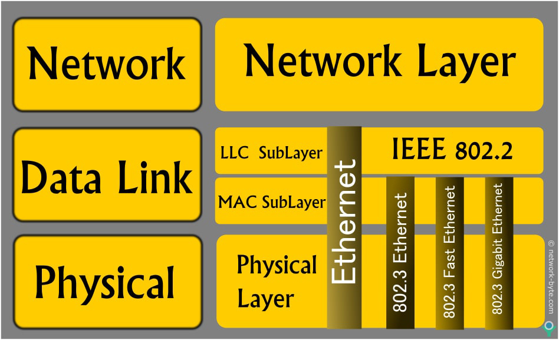{width=66%}</center>

#### Nivell LLC (Logic Link Control)

Nivell **compartit per tots els protocols de la familia Ethernet**. S'encarreha de:

- La lògica dels reenviaments
- Control de fluxe
- Comprovació d'errors

#### Nivell MAC (Medium Acces Control)

- S'encarrega del control d'**accés al medi compartit** (cables en bus, radio...).
- No s'utilitza en protocols punt a punt (no hi ha medi compartit).
- Adreça **MAC**: sistema d'adreçament de nivell 2 (enllaç).
- **Protocols MAC** de nivell d'enllaç:
    - Token Ring | Token Bus
    - CSMA/CD (emprat per Ethernet)

#### Nivell Físic Ethernet

- Quan s'utilitza la ***norma 802.3 per a xarxes Ethernet*** s'utilitza com a sistema de transmissió digital (0's i 1's) la codificació ***Manchester***.

!!! info "La codificació MANCHESTER"

    - **Avantatge**: És una senyal molt **robusta**. Evita problemes típics d'altres sistemes de codificació (unipolar, NRZ, RZ).
    - **Desavantatge**: Consumeix el doble de temps (ample de banda) al tractar-se d'una comunicació **bifàsica**.
    - **0 lògic**: es representa mitjançant una **baixada** de senyal de +0.85V fins a -0.85V.
    - **1 lògic**: es representa mitjançant una **pujada** de senyal de -0.85V fins a +0.85V.
    - **Canal inactiu**: es representa mitjançant una senyal a 0V.
    
    <center>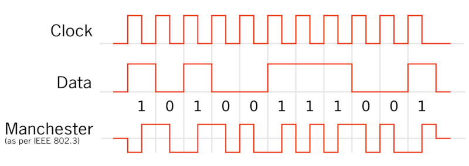{width=66%}</center>

### Comprovació d'errors al nivell d'enllaç LCC

Existeixen distints **codis detectors** d'errors per comprovar si una trama té bits erronis o no. Un dels més senzills és l'anomenat ***codi de paritat simple***. Es basa en contar el nombre de 1's que té la cadena de bits a transmetre i afegir al final de la cadena un dígit més: un 0 (si té un nombre parell de 1's) o un 1 (si la cadena original té un nombre imparell de 1's).

!!! example "Exemple de codi de paritat simple"

    La cadena "11001" conté 3 1's, al ser un nombre imparell, la cadena final emprant codi de paritat simple seria "11001**1**".

Altres codis que existeixen, i que per la seua complexitat no anem a veure en aquest curs, són:

- Codi basat en la ***redundància cíclica (CRC)***
- ***Codi de Hamming***

### Algorisme CSMA/CD

- *Carrier Sense (Sentit de Portadora):* Les estacions escolten el medi abans d'enviar dades per assegurar-se que està lliure.

- *Multiple Access (Accés Múltiple):* Múltiples estacions tenen l'accés simultani al medi compartit, com un cable d'una xarxa local.

- *Collision Detection (Detecció de Col·lisions):* Si dues estacions intenten transmetre alhora i es produeix una col·lisió, aquesta és detectada. Les estacions interrompen la transmissió, esperen un temps aleatori i tornen a intentar.

Aquest algorisme era utilitzat en les primeres implementacions de **xarxes Ethernet amb topologia de bus**, però ha disminuït amb l'ús de topologies més eficients com estrelles i commutadors (*switches*). Les xarxes modernes prefereixen protocols com **CSMA/CA** (*Carrier Sense Multiple Access with Collision Avoidance*) per una gestió més eficient dels recursos i la prevenció de col·lisions.


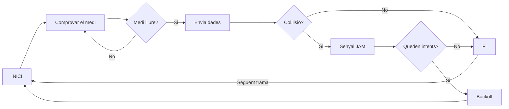

### Tipus d'Ethernet

<center>

| **Ethernet** | **Medi transmissió** | **Longitut màxima per segment** |                          **Característiques**                          |
|:------------:|:--------------------:|:-------------------------------:|:----------------------------------------------------------------------:|
|    10Base5   |      Coaxial 50W     |               500m              |       Especificació original de Ethernet i utilitza coaxial gros       |
|   10BaseTX   |          UTP         |               100m              |   Empra cables de parell trenat UTP per a transmissions fins a 10Mbps  |
|  1000BaseTX  |     4 parells UTP    |               100m              |        Velocitats fins a 1000Mbps amb cablejat mínim de cat 5e         |
|  1000BaseLX  |     Fibra Òptica     |               550m              | Velocitats de 1000Mbps però emprant la fibra com a medi de transmissió |

</center>

!!! info "Truc nemotècnic"

    - Normalment la **primera part** indentifica la **velocitat** de la xarxa:
        10 = 10Mbps, 100 = 100Mbps, 1000 = 1000Mbps
    - La **segona part** indica el **tipus de senyal** que es transmet: digital de banda base (BASE) o senyal modulada (BROAD).
    - La **tercera part** pot ser un número o una lletra:
        - Si és un número indica la **distància** que permet:
            5 = 500m, 2 = 200m
        - Si és una lletra sol indicar el **tipus del cable**:
            T = Parell trenat (Twisted)
            F / SX / LX = Fibra òptica

## Cablejat de xarxa

### Enrutament del cablejat

La forma més senzilla de posar el cablejat és **posar-lo a la vista**. Sols podrem emprar aquest mètode si estem segurs que el cablejat no serà colpejat ni estirat.

Per montar cables sobre la paret necessitarem dispositius que puguen fixar-los:

- Brides de cables adhesives (si no hem de moure'ls mai).
- Brides de cables amb forats perforats (si hem de moure'ls alguna vegada).
- **MAI** emprarem grapes! (TIA/EIA-568A)

<center>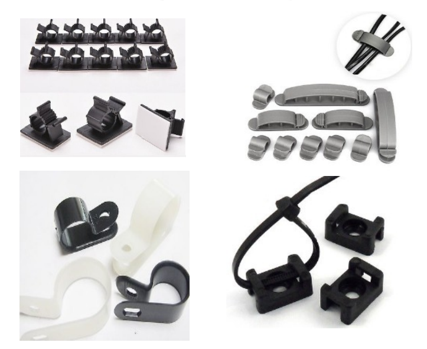{width=66%}</center>

### Muntatge de cables en canaletes

Podem muntar els cables emprant diferents tipus de canaletes:

- Canal montat sobre la paret amb coberta mòvil:
    - Canaleta decorativa
    - Millor acabament
    - S'empra per col·locar el cable sobre una paret on quedaria visible.

<center>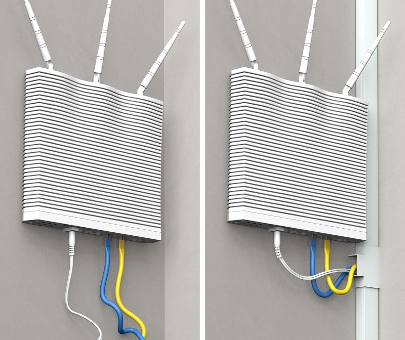{width=50%}</center>

- Canal:
    - Alternativa menys atractiva
    - Suficientment gran com per contindre diferents cables
    - Emprada generalment en espais poc visibles

<center>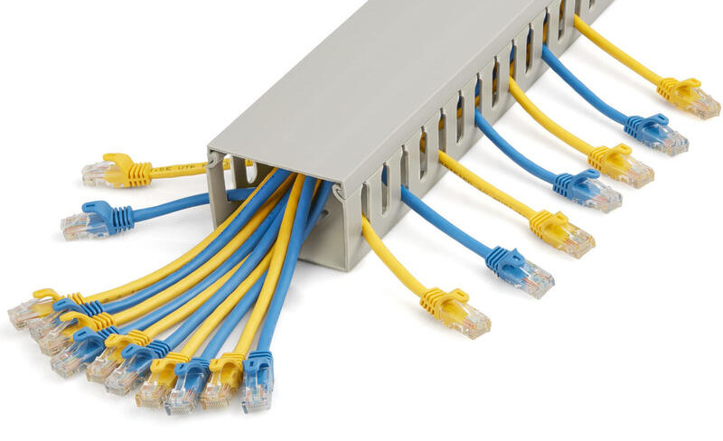{width=50%}</center>

!!! danger "Normes de seguretat personal en el muntatge de canaletes"

    1. Desconectar de la llum tots els circuits que passen per el lloc de treball.
    2. Abans de treballar, tenir localitzats els extintors d'incendis.
    3. Emprar roba adequada.
    4. Si es treballa amb sostres falsos s'ha d'inspeccionar la zona.
    5. Si hem de tallar o serrar, cal protegir-nos els ulls amb ulleres de seguretat.
    6. Consultar al tècnic de manteniment si hi han materials perillosos.
    7. Mantenir la zona de treball ordenada i protegida.

### Suport de cablejat horitzontal

- Molts instaladors extenen el cablejat per àtics o falsos sostres, així no queden a la vista.
- No s'han de col·locar els cables directament sobre els panells de sostre, hem d'emprar suports especials o bastiments.

<center>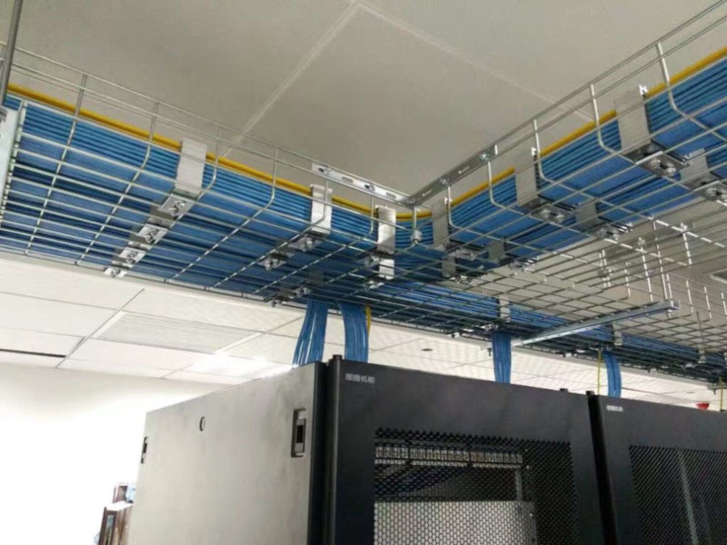{width=66%}</center>

<center><iframe width="560" height="315" src="https://www.youtube.com/embed/XPZDHKUzItU?si=ctvH0uM9DBiZTA1p" title="YouTube video player" frameborder="0" allow="accelerometer; autoplay; clipboard-write; encrypted-media; gyroscope; picture-in-picture; web-share" allowfullscreen></iframe></center>

### Muntatge d'armaris i *patch-pannels*

El panell de connexions o *patch pannel* és un dispositiu d'interconnexió que agrupa pins i ports i solen presentar la següent estructura:

- Part frontal: Ports de connexió RJ45 mascle.
- Part posterior: Fils i pins per a conexions RJ45 femella.
- Connexions elèctriques

<center>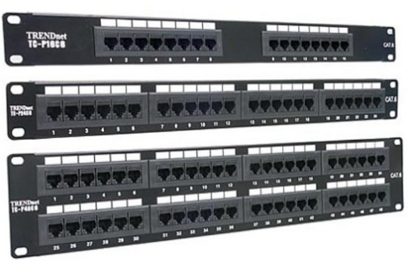{width=50%}</center>

### Personal

En instal·lacions de xarxes mitjanes o grans, podem trobar-nos amb diferents persones, cadascuna d'elles amb tasques distintes:

- **Gerent de projecte**: s'encarrega d'escriure la documentació, supervisar el projecte, controlar el personal, les dates d'inici i acabament, certificacions, normatives de seguretat...
- **Gerent de materials**: s'encarrega de les caixes de ferramentes, materials, cablejat, rosetes, switchs, routers... que facen falta per a la instal·lació. Tracta amb proveïdors i ajuda a gerent a establir calendaris d'execució de la instal·lació.
- **Planificador/Col·locador de cables**: planifica per on passen els cables i els col·loca seguint la normativa vigent.
- **Acabador de cables**: realitza les terminacions dels cables (rosetes, connexió) de les àrees de treball.

### Termes

 Termes habituals que podem trobar-nos en instal·lacions de xarxa:

- **POP (point of presence), punt de presència**: és el punt on arriben els serveis de telecomunicacions a l'edifici i on es connecten amb les instal·lacions de comunicacions a prop de l'edifici.
- **MDF (main distribution facility), centre de distribució principal**: és el lloc de l'edifici on es concentra tota la infraestructura de cablejat i on es connecta amb la companyia telefònica que presta els serveis de veu, dades...
- **IDF (intermediate distribution facility), centro intermedio de distribución**: en edificis de moltes plantes o molt extesos és convenientconcentrar previament parts del cablejat en centres més xicotets que es connectaran al *MDF* a través de *backbone* o cable principal.
- **WA (working area), àrea de treball**: és on posem els equips, impressores, dispositius finals de l'usuari.
- **TR (telecomunications room), armari de telecomunicacions**: son els armaris es situen a la planta i recullen el cablejat horitzontal.
- **Cablejat horitzontal**: els cables que es tiren desde les àrees de treball fins l'armari de telecomunicacions situat a la mateixa planta.
- **Cablejat vertical (backbone)**: cablejat que connecta entre sí els diferents armaris de telecomunicacions verticalment, entre les diferents plantes de l'edifici. Quan no hi ha armaris també s'asocia al cablejat que uneix distints dispositius de xarxa (*hub*, *switch*, *router*...).

 <center>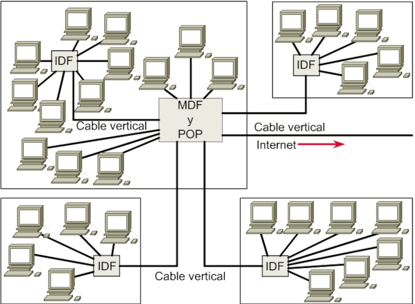{width=66%}</center>

### Organismes i normativa

El cablejat estructurat està definit com un sèrie de normatives que tenen com objectiu **contruir xarxes que treballen al màxim rendiment i que siguen fàcils de modificar o ampliar**. Aquestes normatives no sols afecten al cablejat de xarxa, també al telefònic, CCTV...

ALgunes de les organitzacions que creen els estàndards són:

- **ANSI** (*American National Standards Institute*), és una organització encarregada de definir estàndards, particularment relacionats amb xarxes de telecomunicació.
- **EIA** (*Electronic Industry Association*) desenvolupa normativa referent a equips electrònics, targetes de xarxa...
- **TIA** (*Telecomunications Industry Association*) que ha creat entre d'altres les normes **TIA 568A** i **TIA 568B** que especifiquen com s'ha d'instal·lar el cablejat en edificis comercials. En particular, hi han algunes normatives TIA importants:
    - TIA/EIA 568B1: especifica requeriments generals.
    - TIA/EIA 568B3: especifica requeriments de cablejat de parell trenat i fibra òptica.
    - TIA/EIA 569A: especifica com fer passar el cablejat per l'edifici.
    - TIA/EIA 570: normativa de telecomunicacions per a edificis residencials.

