# UD4. Dispositius específics d'una xarxa local

## Introducció

Els dispositius d'interconnexió de xarxes treballen entre els nivells 1 i 3 del model OSI, és a dir, físic, enllaç i xarxa.

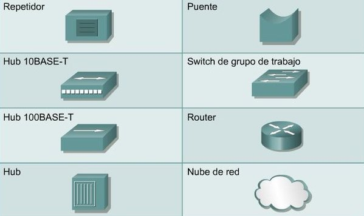{width=50%}

## Repetidor

El repetidor **rep un senyal atenuat i retorna el senyal al seu estat original**. Per exemple: hem vist que la distancia màxima del cablejat UTP és de 100 m, és per això que necessitarem repetidors per tal d'amplificar la cobertura.

Els repetidors treballen a nivell 1 (físic):

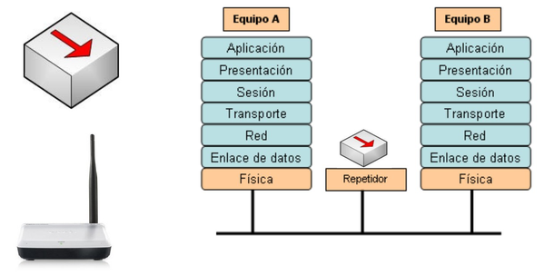{width=50%}

L'anomenarem **amplificador** si s'encarrega de regenerar senyals **analògics** i li direm **repetidor** si regenera senyals **digitals** a escala de bits.

Els repetidors i amplificadors presenten algunes **limitacions**:

- **ATENUACIÓ**: si el senyal arriba massa atenuada, no pot reconstruir-se correctament, per la qual cosa, existeixen distàncies màximes de separació depenent del medi de transmissió.
- **NOMBRE DE DISPOSITIUS**: cada vegada que s'amplifica un senyal analògic s'afegeix un component de soroll. Un senyal no pot travessar un nombre infinit d'amplificadors perquè es distorsionaria massa i no seria una còpia reconstruïda de l'original.

De vegades, **els repetidors es poden emprar per a convertir el senyal d'un sistema de cablejat a altre**. Per exemple, un repetidor podria tindre una entrada 10Base2 (coaxial) i altra 10BaseT (parell trenat).

Els repetidors s'empren tant en **cables de coure** portadors de senyals elèctrics com en **cables de fibra òptica** portadors de llum.

S'empren també als **cables transcontinentals i transoceànics** perquè l'atenuació (pèrdua de senyal) en aqueixes distàncies seria completament inacceptable sense ells.

Un **repetidor wifi**, també anomenat **amplificador wifi** compleix amb les característiques de funcionalitat d'un repetidor perquè recull un senyal que rep i l'amplifica amb l'objectiu d'augmentar el rang del senyal.

## Hub

El hub o concentrador s'encarrega de **regenerar els senyals de xarxa** d'igual forma que un repetidor, però **permet més d'un dispositiu**, per això, de vegades, se'ls anomena repetidors multiports.

Els **hubs** es consideren, per tant, dispositius de **capa 1** donat que sols regeneren el senyal i l'envien mitjançant un *broadcast* (envien informació a tota la resta d'equips) a tots els ports.

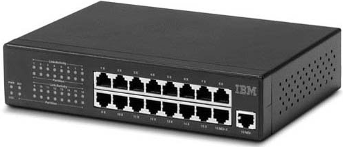{width=50%}

- **AVANTATGES**:
  - Crea un **punt de connexió central** per als ordinadors.
  - Augmentem la **fiabilitat** de la xarxa en regenerar el senyal i independitzar cada connexió.
  - **Ràpids** perquè no ham de processar el senyal. Es limiten a copiar bits.
  - **No requereixen configuració**.
  - **Barats**.
- **DESAVANTATGES**:
  - **No segmenten la xarxa**: si es produeix una col·lisió, aquesta es propaga a tots els segments de la xarxa.
  - **Problemes de privadesa**: no és capaç de decidir on s'envia el senyal i ho envia a tots.

!!! info
    Actualment, els hubs estan en desús perquè han sigut substituïts pels switchs i sols podem trobar-ne en instal·lacions antigues.

### Tipus de Hubs

- **Hubs pasius**: la seua funció principal consisteix a interconnectar tota la xarxa.
- **Hubs actius**: a banda de la seua funció bàsica de concentrador, també amplifiquen i regeneren el senyal rebut abans de reenviar-lo.

### Tipus de connexions al Hub

- **Connectors per unir estacions de treball**.
- **Connectors per a unir-se a altres Hubs**: permeten la connexió de diversos Hubs mitjançant **enllaços especials (creuats)**. De vegades existeix un botó, anomenat ***crossover*** que ha de mantenir-se actiu per poder unir Hubs. Altres vegades aquest enllaç està sempre actiu i sol tenir el nom d'***uplink***.

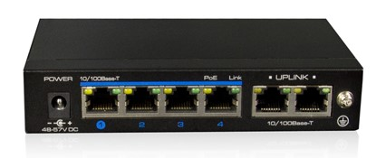{width=50%}

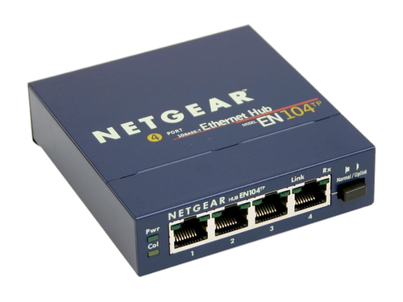{width=50%}

### Connexió entre Hubs

- **Connexió en cascada**: es permeten fins a 4 Hubs si la xarxa treballa a 10 Mbps o 2 si la xarxa treballa a 100 Mbps. Si es volen connectar més serà necessari emprar repetidors intermedis o emprar connexions en estrela (més recomanable).
- **Connexió en estrela**: Cada Hub connecta el seu port 1 al Hub central. Els cables que els connecten són iguals al de les estacions de treball. Açò permet que l'única limitació siga el nombre de ports del Hub.

### Topologia Hubs

- **FÍSICA**: s'estableix una **topologia en estrela**.
- **LÒGICA**:
  - **BUS(HUB)**: la xarxa es comporta com un bus, enviant els senyals que els arriben per totes les eixides. Inconvenient: Si 2 estacions transmeten a la vegada, es produeixen col·lisions.
  - **ANELL(MAU)**: s'envia el senyal que li arriba per un port al següent.

En ambdós casos el protocol corresponent haurà de controlar qui pot transmetre per tal d'evitar col·lisions.

!!! info
    - A les xarxes locals antigues sense concentradors si fallava algun enllaç, tota la xarxa deixava de funcionar i el tècnic havia de comprovar un per un tots els cables i totes les connexions perquè no sabia amb antelació quin havia fallat. Xafar un cable de xarxa o enganxar-se amb ell podia posar "de volta" el departament o l'empresa sencera.
    - A les xarxes amb concentradors, en compte de distribuir les connexions, el concentrador les centralitza en un únic dispositiu, mantenint indicadors lluminosos del seu estat i impedint que una d'elles puga fer fallar tota la xarxa. Cada estació es connecta directament al concentrador mitjançant el cable corresponent i, si eixe enllaç falla, la xarxa segueix funcionant i sols queda aïllat l'ordinador afectat.

## Pont o Bridge

Un pont és un **dispositiu de capa 2 (enllaç)** dissenyat per **connectar dos segments** LAN, que poden tenir **diferents topologies i diferents protocols** a nivell MAC i d'enllaç. Per exemple, poden connectar una xarxa *Ethernet* amb una *Token ring*.

Un pont és un dispositiu amb dos ports que tenen certa **capacitat de control**, permetent acceptar i reexpedir trames en funció del seu contingut.

El propòsit d'un pont és **filtrar el tràfic d'una LAN**, perquè el tràfic local seguisca essent local, però **permetent la connectivitat a altres parts (segments) de la LAN** per tal d'enviar tràfic dirigit a aquestes altres parts.

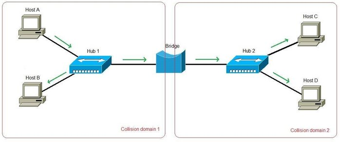{width=75%}

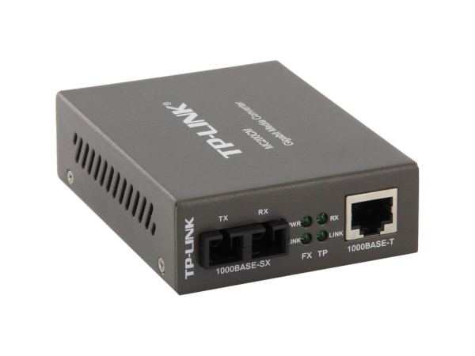{width=50%}

???+ question "Què és un segment d'una xarxa?"
    Quan la xarxa es divideix en 2 segments es consideren dues parts distintes de la xarxa. Per exemple, la xarxa del pis 1 i la del pis 2 que estan connectades; en una petita empresa que té dues oficines en dos edificis i estan connectats entre si...

???+ question "Si un pont permet la connectivitat entre 2 segments, com pot detectar el pont quin és el tràfic d'un segment i quin no?"
    Emprant el mateix sistema que el servei de correus, mitjançant adreces físiques (MAC) un pont identifica de quin segment és el tràfic que li arriba.

    Cada dispositiu de xarxa té una adreça MAC exclusiva a la targeta de xarxa, el pont **rastreja quines són les adreces MAC que estan ubicades a cada costat d'ell** i pren les seues decisions basant-se en un llistat d'adreces MAC.

    

### Domini de col·lisió

Grup de dispositius connectats al mateix medi físic, de manera que si dos dispositius accedeixen al medi al mateix temps, el resultat serà una col·lisió entre els dos senyals.

A causa d'aquestes col·lisions es produeix un consum inadequat de recursos i d'amplada de banda que pot dur a congestions serioses de la xarxa. Com menor siga la quantitat de dispositius en un domini de col·lisió, millor funcionarà la xarxa.

Els repetidors o els hubs no poden aïllar el tràfic *broadcast* que es genera a la xarxa en treballar al nivell 1 d'OSI. El **pont** no pot prendre decisions d'encaminament (com arribar a un destí) perquè no treballa a nivell 3 d'OSI. Tanmateix, en operar al **nivell 2**, pot treballar amb adreces MAC i saber per la seua **taula d'adreces MAC** a quin port reexpedir la trama si l'equip es troba a l'esmentat segment.

En la pràctica, **el pont divideix un domini de col·lisió en 2 segments separats, augmentant el rendiment de la xarxa pel fet d'evitar col·lisions**.

Els ponts poden crear-se mitjançant:

- **Software**: Un ordinador amb dues targetes de xarxa i una aplicació que li permeta actuar com a pont.
- **Hardware**: dispositiu específic.

{width=75%}

## Switch o Commutador

Permet la interconnexió de xarxes a nivell d'enllaç.

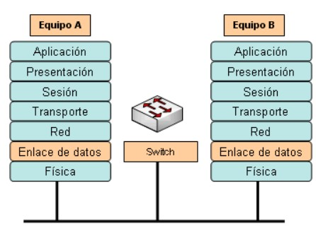{width=50%}

Emprant l'adreça MAC, els switchs són capaços d'**enviar les dades tan sols cap al port de destí**.

El commutador permet **repartir l'amplada de banda** de la xarxa d'una manera apropiada en cada segment de la xarxa de forma transparent als usuaris.

Existeixen al mercat alguns commutadors de nivell 3 que incorporen funcions d'encaminament però amb la velocitat de la commutació.

Els switchs són gestionables mitjançant **protocols** típics de gestió de xarxa: SNMP, RMON... La majoria d'ells són **gestionables via web**.

La majoria dels switchs son **apilables i fàcilment escalables**. Solen connectar-se entre ells mitjançant el port ***MDIX o MDI-X (Medium Dependent Interface Crossover)***.

Emprant tecnologia específica dels switchs, les xarxes d'àrea local virtuals (**VLANs**) permeten que els nodes de la xarxa es connecten a xarxes lògiques en compte de xarxes físiques.

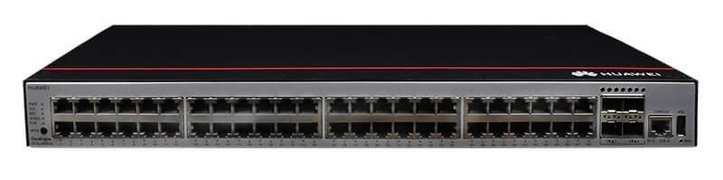{width=75%}

## Router o Encaminador

Permet la **interconnexió de xarxes a nivell de xarxa (nivell 3)**. S'encarrega de seleccionar la millor ruta per tal que els paquets (datagrames) arriben al seu destí.

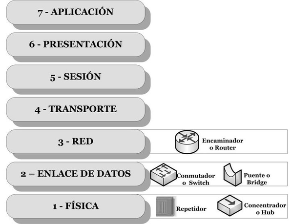{width=50%}

Els encaminadors s'han convertit en el nucli d'Internet al ser els reguladors del tràfic. Prenen **decisions basades en grups d'adreces de xarxa (mitjançant les adreces IP i les màscares)** emprant el protocol IP.

Els routers també poden **connectar distintes tecnologies de capa d'enllaç**. Per exemple Ethernet, Token-ring i FDDI (fibra òptica).

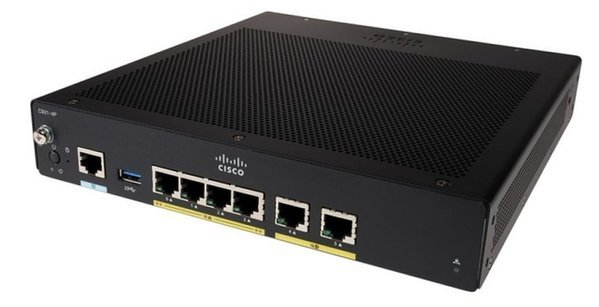{width=75%}

### Característiques

- **Interpreten les adreces lògiques (adreces IP)** de la capa 3 (xarxa), en compte de les adreces MAC de la capa d'enllaç com fan els ponts o commutadors.
- En treballar en un nivell superior són capaços de **canviar el format d'una trama** per a permetre operar amb tecnologies d'enllaç distintes: Ethernet, Token-ring, FDDI i ATM.
- **Proporcionen seguretat** a través de sofisticats filtres de paquets (datagrames) actuant de tallafocs o *firewalls*.
- **Redueixen la congestió de la xarxa** aïllant el tràfic i els dominis de col·lisió a les distintes subxarxes a les quals estan connectats.
- Permeten l'existència de diferents **rutes alternatives contra congestions i fallades** a les comunicacions.
- Els protocols de nivell 3 (xarxa) més emprats pels encaminadors són: ***IP, IPX, AppleTalk, DECnet, XNS***.

Els routers comercials es poden classificar en 2 segons com reompli la seua taula d'encaminament:

- **Encaminadors amb algorisme d'encaminament estàtic (static routing)**: la taula d'encaminament és programada per l'administrador de xarxa.
  - **Avantatges**:
    - Ràpids i senzills
  - **Desavantatges**:
    - No té capacitat per aprendre la topologia de la xarxa.
    - Qualsevol canvi requereix una intervenció de l'administrador de l'encaminador.
- **Encaminador amb algorismes d'encaminament adaptatiu (dynamic routing)**: són capaços d'aprendre per ells mateixos la topologia de la xarxa.
  - **Avantatges**:
    - Són capaços d'aprendre per ells mateixos.
    - Són més flexibles.
  - **Desavantatges**:
    - Complexos i amb rendiment menor en haver de confeccionar dinàmicament la taula d'encaminament.

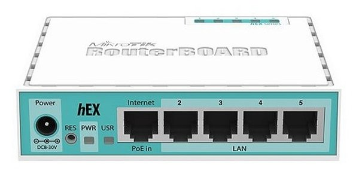{width=75%}

### Protocols d'encaminament

Un protocol d'encaminament és el que empra el router per a comunicar-se amb altres routers i aprendre la topologia de la xarxa. És utilitzat per calcular quin és el millor camí (***best path***) per tal d'arribar al destí.

El millor camí dependrà de l'activitat de la xarxa (enllaços actius, velocitat de transmissió entre enllaços...)

El **cost d'una ruta** és un valor numèric que representa que bo és el camí que la representa: a menor cost, millor camí.

Existeixen **protocols basats en el vector-distància** (RIP, RIPv1, RIPv2, BGP) i altres **basats en l'estat de l'enllaç**.

### Temps de convergència

Quan es produeix una **alteració topològica** a la xarxa (s'afig un node o deixa d'estar disponible, una nova ruta al destí...)s'han de **recalcular les rutes** per tal d'adaptar-se a la nova situació.

El **temps de convergència** és el temps que tarda l'encaminador a trobar el millor camí quan es produeix una alteració topològica a la xarxa.

Cal dissenyar protocols d'encaminament que tinguen **menor temps de convergència** possible per tal que siguen més flexibles davant un canvi.

### Passarel·les

Moltes vegades es confon el terme passarel·la amb el terme encaminador o router.

A l'arquitectura TCP/IP una passarel·la és un dispositiu que s'encarrega de l'encaminament de la informació i la interconnexió de xarxes diferents.

La **passarel·la (porta d'enllaç o *gateway*)** és molt més que un router, perquè s'encarrega de **comunicar xarxes amb distinta arquitectura**: TCP/IP, ATM, OSI, X.25...

Els problemes que poden sorgir en la comunicació entre dues xarxes amb diferents tecnologies són diversos. Alguns d’ells són:

- **Diferents protocols de comunicació**: Les xarxes amb diferents tecnologies poden utilitzar protocols de comunicació diferents. Això pot dificultar la comunicació entre elles. Les passarel·les han de ser capaces de traduir els protocols de comunicació per permetre la comunicació entre les xarxes.

- **Diferents formats de dades**: Les xarxes amb diferents tecnologies poden utilitzar formats de dades diferents. Això també pot dificultar la comunicació entre elles. Les passarel·les han de ser capaces de convertir els formats de dades per permetre la comunicació entre les xarxes.

- **Problemes de seguretat**: Les passarel·les poden ser punts vulnerables en la xarxa. Si no estan ben configurades o no es mantenen actualitzades, poden ser atacades per pirates informàtics. Això pot posar en perill la seguretat de les dades que es transmeten entre les xarxes.

!!! info "... i els *Routers* de casa?"
    Una vegada vists els dispossitius principals de xarxa, podem dire que els *Routers* que ens instal·len les operadores d'Internet son un *Frankenstein*, fruit del agrupament de diversos dispossitius com ara: *Routers*, *Switchs*, Passarel·les, Punts d'accés sense fils...
    
    
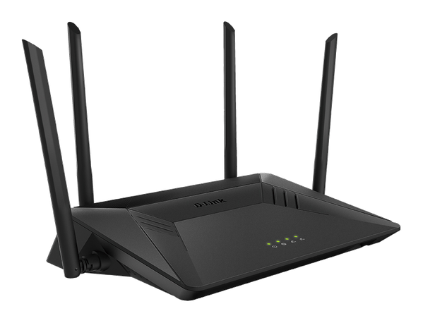{width=50%}

