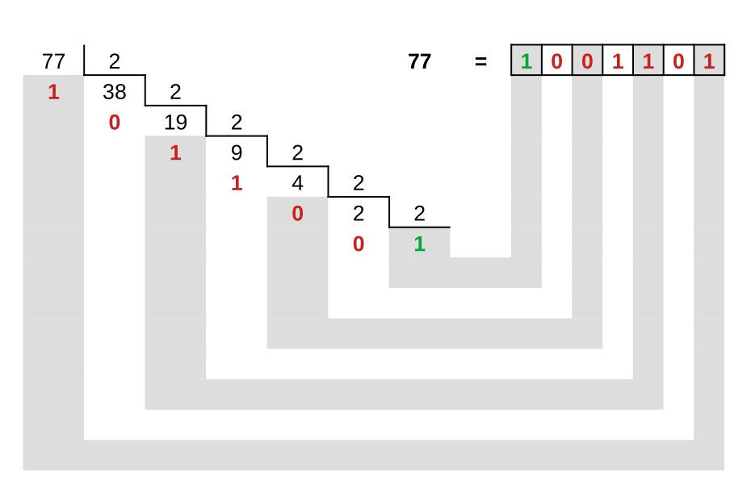
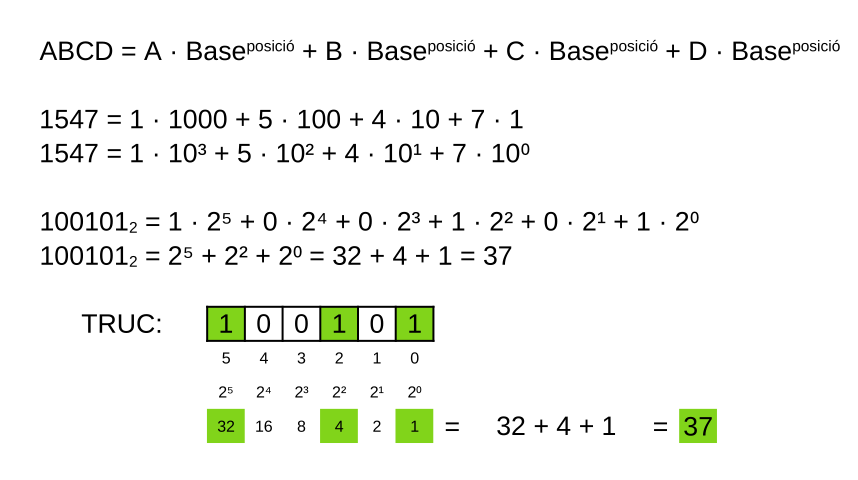
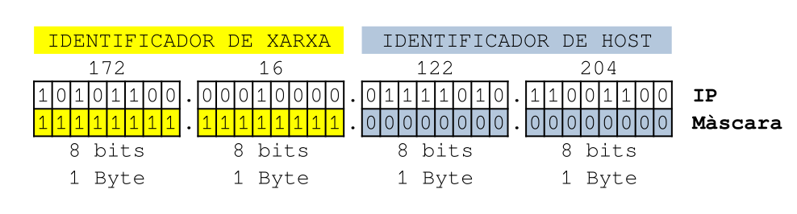
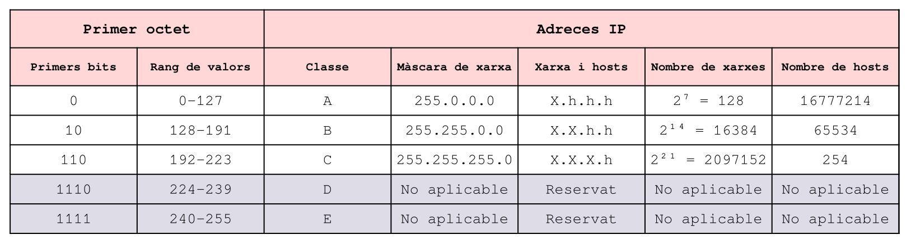
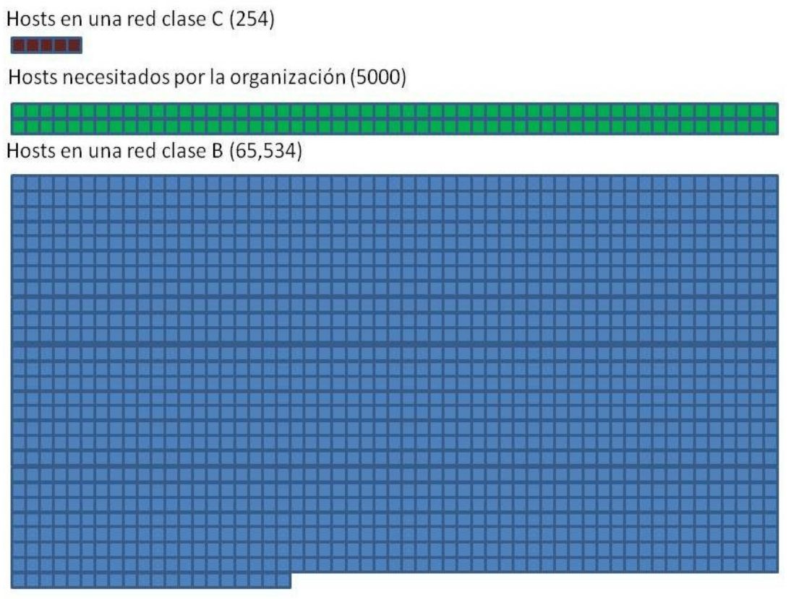
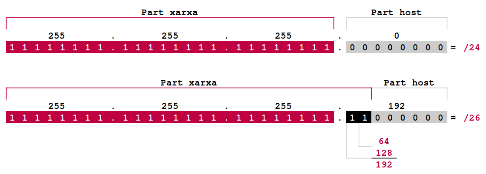
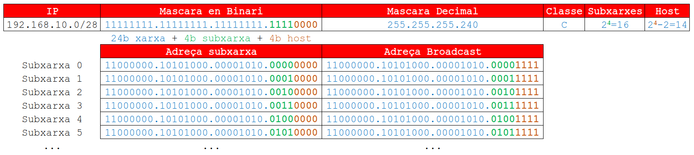

# UD5. Instal·lació i configuració d'equips de xarxa

## El sistema operatiu en xarxa

La xarxa està formada per nodes i gran **part de la funcionalitat d'una xarxa depen del software de xarxa que està instal·lat als seus nodes**.

Al mateix temps, cadascun d'aquests nodes **pot tenir corrent un sistema operatiu distint**.

El sistema operatiu de **cada node pot tenir instal·lats i configurats protocols de xarxa distints**. Son aquests protocols de xarxa els qui seran capaços d'entendre i processar la informació que reba altre node.

Actualment tots els sistemes operatius empren el protocol TCP/IP, el que facilita la interconnexió.

- **Microsoft Windows**: tenia com a protocol de xarxa natiu ***NetBeui*** i era accessible a través de NetBIOS. Conserva aquesta interfície per compatibilitat, però el **protocol natiu actual é1 Bytes TCP/IP**.
- **UNIX i distribucions GNU/Linux**: GNU/Linux engloba a tots els sistemes operatius que seguisquen la tecnologia UNIX, però que es distribueixen sota llicència GP (GNU Public License). La tecnologia de **xarxa nativa** de Linux és **TCP/IP**, però per compatibilitat incorpora software amb les piles de protocols de **Microsoft y Novell Netware**.
- **Apple Mac OS X**: Antigament emprava la pila de protocols ***AppleTalk***, però actualment el seu **protocol de xarxa natiu és TCP/IP**.

!!! tip "Documentació"
    Hem de conservar sempre una **documentació bàsica del software** que opera a la xarxa. Hi ha que **identificar els sistemes operatius de cada ordenador connectat a la xarxa (clients i servidors)**. La identificació ha de tenir la **versió del sistema, l'idioma, els parxes** que tinga instal·lats.

    Per exemple:

    - Linux amb Ubuntu versió 23.04
    - Windows 10 SP2

### Components del sistema

Un sistema operatiu és molt complexe i per a realitzar les seues funcions relacionades amb la cimunicació en xarxa necessita recolzar-se en:

- **Controladors (drivers) de l'adaptador de xarxa**: Software que comunica el *hardware* de la targeta de xarxa amb el sistema operatiu. Si no tenim el controlador adequat es poden produir errors que impedeixen l'arranc del sistema o el deixen en una situación irrecuperable.
- **Serveis en Xarxa**: Un servei en un SO és una **tasca que s'executa en segon plà (background) proporcionant una utilitat** determinada als clients que realitzen peticions a l'esmentat servei. En Linux, aquestes tasques s'anomenen **dimonis**. Un servei de xarxa és aquella tasca a la que s'accedeix mitjançant un ***socket*** (protocol + port) i rep peticions a través de la xarxa. Per exemple, el **servei d'accés a fitxers en xarxa** o el **servei d'impressió en xarxa**.
- **Piles de protocols**: Son les families de protocols que instalem en els Sistemes Operatius. Per exemple: TCP/IP, SPX/IPX, NetBeui i AppleTalk. De vegades s'instalen amb el software del SO i altres vegades és necessari que instalem altres piles de protocols o serveis de xarxa. 

## Families de protocols en Microsoft

- **Protocol NetBEUI**: sols pot emprar-se en xarxes locals perquè no és capaç d'encaminar-se per a dirigir-se a altres xarxes. Si la xarxa és xicoteta i no es pensa en un creixement a curt termini es podria emprar per donar suport per ser molt simple i fàcil d'emprar. De totes formes, es recomana TCP/IP.

- **Protocol IPX/SPX**: protocol contruit per *Novell* per al seu sistema *NetWare*. Permet oferir un servei bàsic d'encaminament a xarxes xicotetes i mitjanes. Recomanable quan les estacions de treball de Microsoft han de conviure amb servidors NetWare.

- **Protocol TCP/IP**: especialment dissenyat per poder encaminar-se entre distintes xarxes d'àrea local. Recomanable si la xarxa d'àrea local ha d'estar connectada a Internet o deu estar molt seggmentada.

## Familia de protocols TCP/IP

El model TCP/IP és un model **més pràctic** que el model OSI. Primerament es dissenyaren els protocols y després s'integraren per capes en l'arquitectura.

El model TCP/IP és molt **més simple**, doncs redueix les capes de 7 a 4.

| Arquitectura OSI | Arquitectura TCP/IP | Funció |
|:---:|:---:|:---:|
| Aplicació | Aplicació | Conté protocols utilitzats per a les comunicacions de procés a procés, com HTTP, FTP, SMTP, etc. |
| Presentació | - | Proporciona una representació comuna de les dades transferides entre els serveis de la capa d'aplicació, com la codificació, el xifratge i la compressió. |
| Sessió | - | Gestiona l'establiment, el manteniment i la finalització de les sessions entre els processos d'aplicació. |
| Transport | Transport | Proporciona serveis de comunicació fiables i no fiables entre els hosts, com TCP i UDP. |
| Xarxa | Internet | S'encarrega de l'enrutament dels paquets a través de la xarxa, utilitzant protocols com IP, ICMP i ARP. |
| Enllaç de dades | Host-xarxa | S'encarrega de la transmissió de les dades entre els dispositius de la xarxa, utilitzant protocols com Ethernet, Wi-Fi i PPP. |
| Física | Host-xarxa | S'encarrega de la conversió de les dades en senyals elèctrics, òptics o sense fils que es poden transmetre pel medi físic. |

### Protocol IP

- El protocol IP realitza tasques bàsiques d'encaminament per a conseguir transportar dades desde un orige a un destí.
- L'**orige i el destí poden estar en xarxes amb tecnologies totalment diferents** i pot haver-hi diverses rutes possibles per el que deurà pendre decisions i triar la millor.
- **No hi ha seguretat a l'entrega**.
- **No hi ha control d'errors**.
- **Els paquets poden arribar desordenats**.
- Els equips d'una xarxa tenen asociat u nnúmero d'**adreça IP** (adreça lògica, no confondre amb el número MAC de l'adaptador de xarxa que és l'adreça física) que permet identificar-los en tot Internet.
- L'**adreça IP és un número binari de 32 bits**. La seua representació en decimal està formada per 4 números separats per punts, cadascún dels quals pot pendre valors entre 0 i 255.

!!! example "Adreça IP binària de 32 bits"
    11000000 . 10101000 . 00100010 . 00001011 = 192.168.100.15

#### Conversió de sistema decimal a sistema binari

Per convertir un número decimal en binari es realitzen successives divisions entre 2 (base del sistema) i van recollint-se els residus de cada divisió **en ordre invers**.

!!! example "Exemple de pas de decimal a binari"
    
{width=75%}

#### Conversió de sistema binari a sistema decimal

Per tal de convertir un número binari a decimal haurem d'aplicar el **Teorema fonamental de la numeració**.

!!! example "Exemple de pas de binari a decimal"
    
{width=75%}

#### Parts de l'adreça IP

- L'adreça IP d'un dispositiu està **estructurada en dues parts**:
    - **Identificador de xarxa** a la que està connectat el dispositiu
    - **Identificador del dispositiu**

- **Aquesta estructura facilita l'encaminament dels routers**, de forma que per encaminar un datagrama, els routers analitzaran l'dentificador de xarxa al qual pertany i ho encaminaran cap a ella. Una vegada dintre de la xarxa, el o els routers de dita xarxa tindran que analitzar l'indicador del host de destí per encaminar el datagrama fins ell.

- L'dentificador de xarxa pot tenir el tamany que es desitge, en funció del tamany de la xarxa.

{width=75%}

##### Máscara de xarxa

És un número similar a l'adreça IP i **determina quina part de l'adreça IP pertany a l'equip i quina part pertany a la xarxa**. Per definir el prefixe de l'adreça IP, és a dir, el que es coneix com identificador de xarxa, s'utilitza la denominada máscara de xarxa, que és un número binari de 32 bits que defineix a les posicions a "1" el prefixe o identificador de xarxa i a les posicions a "0" el dufixe o identificador de host.

- Actualment per tal d'identificar la máscara de cada PC se li afig */XX* a l'adreça IP. Éssent *XX* el nombre de bits a "1" de la máscara de xarxa.

!!! example "La "màscara curta""
    - IP = 192.168.2.200 -- Màscara: 255.255.255.0
    - Nomenclatura equivalent: IP = 192.168.2.200/24

##### Adreça de xarxa

L’adreça de la xarxa és la part de l’adreça IP que identifica la subxarxa on es troba el dispositiu. Com ja hem vist, la màscara de xarxa és un nombre que indica quants bits de l’adreça IP pertanyen a la xarxa i quants al host.

Per calcular l’adreça de la xarxa, hem de fer una operació **AND lògica** entre l’adreça IP i la màscara de subxarxa. Això significa que si els dos bits són 1, el resultat és 1; si no, el resultat és 0.

!!! example "Exemple de càlcul d'adreça de xarxa"
    Suposem que tenim l’adreça IP ***192.168.1.100*** i la màscara de subxarxa ***255.255.255.0***. En binari, això seria:

    IP:   11000000.10101000.00000001.01100100
    
    Mask: 11111111.11111111.11111111.00000000

    Fent l’operació AND entre els dos, obtenim:

    Adreça de xarxa:  11000000.10101000.00000001.00000000

    Aquest és el resultat en binari de l’adreça de la xarxa. Si el convertim a decimal, obtenim:

    Adreça de xarxa:  192.168.1.0

### Protocol TCP

- El TCP és un protocol per al control de la transmissió de les dades.
- Es dissenyà per realitzar connexions segures en xarxes insegures.
- Soluciona els problemes existents en IP:
    - **Aporta control d'errors**.
    - **Seguretat a l'entrega**.
    - **Control de fluxe. Els paquest arriben ordenats**.
- Es complementa de manera perfecta amb IP per **aportar una comunicació de dades fiable i ordenada**. Per això en ocasions es fa referència a TCP/IP com si fos un únic protocol, però realment en son dos.
- Els punts d'accés al servei en la capa de transport s'anomenen ***sockets, ports o connectors TCP/IP***. Darrere de cada *socket* s'implanta un servei de xarxa. Per exemple, 80 és el port que identifica les peticions de xarxa cap a un servidor web.
- Quan algú a la xarxa requereix un servei, envia un missatge al *socket* o port que identifica el servei. Alguns serveis requereixen més d'un *socket* per al seu funcionament.

## Adreçament IP (Classful)

Per tal de facilitar la administració, els dissenyadors de l'esquema d'adreçament IP vàren determinar l'existència de 5 classes úniques: A, B, C, D i E.

{width=100%}

### Classes de una adreça IP: classe A

- Una **adreça IP de classe A** sempre té el primer bit (el que es troba més a l'esquerra) a '0', és a dir, **el primer octet té un valor decimal entre 0 i 126**. La xarxa 127.0.0.0 no pot emprar-se per estar reservada per a proves de l'adaptador de xarxa.

- Les adreces IP de classe A empren solament els **8 primers bits per identificar la part de xarxa** de l'adreça, la resta ***(tres octets) s'utilitzen per especificar la part del host*** de l'adreça.

- Les ***adreces IP de classe A que NO es poden utilitzar*** son:

    - Una **primera adreça IP per a l'identificador de la xarxa** (primer octet amb el valor de la xarxa corresponent i la resta d'octets amb els seus bits a valor zero).
    - Una **adreça IP per a difussió o *broadcast***, que tindrà el primer octet amb el valor de la xarxa i la resta d'octets amb els bits a valor 1, és a doir 255 en decimal.

- La **máscara de xarxa per defecte** de les adreces IP de classe A son **255.0.0.0**

### Classes de una adreça IP: classe B

- Una **adreça IP de classe B** sempre té els seus dos primers bits a valor binari '10', és a dir, **el primer octet tindrà un valor decimal entre 128 i 191**.

- La **máscara de xarxa per defecte** de les adreces IP de classe B son **255.255.0.0**

- Les adreces de classe B utilitzen els **dos primers octets per a l'identificador de xarxa**, i els **dos últims octets per a l'identificador de host**. En una xarxa de classe B existiran 65.536 IPs distintes, de les quals dues estan reservades per a la xarxa (bits de host TOTS a zero) i per al *broadcast* (bits de host TOTS a uns). Per tant, 65534 nombre màxima de connexions.

### Classes de una adreça IP: classe C

- Una adreça de classe C sempre té els seus tres primers bits al valor binari '110', és a dir, **el primer octet tindrà un valor decimal entre 192 i 223**.

- La **màscara de xarxa per defecte** de les adreces IP de classe C és **255.255.255.0**

- Les adreces de classe C utilitzen els **tres primers octets per a l'identificador de xarxa** i l'**últim octet per a l'identificador de host**. En una xarxa classe C existiran un màxim de 256 IPs distintes, de les quals dues estan reservades (xarxa i *broadcast*), per tant tindre 254 connexions reals.

### Classes de una adreça IP: classe D

- Les adreces IP de classe D son adreces **multicast o multienviament** que s'utilitzen únicament **el primer octet com identificatiu de xarxa** i els **tres octets restants** s'utilitzen com **identificatiu de grup de host**.

### Classes de una adreça IP: classe E

- Les adreces Ip de classe E estan reservades per a ús experimental en projectes d'investigació en la xarxa. S'utilitzen únicament per a futurs projectes i experimentacions.

## Adreces públiques i privades

Una **adreça IP pública** és aquella que **identifica de forma única una connexió a Internet**.

Les **adreces IP privades** son adreces IP que s'utilitzen única i exclusivament en **xarxes d'àrea local perquè no poden ixir a navegar per Internet**, de fet, si un datagrama d'una xarxa privada ixquera accidentalment a Internet seria descartat perquè eixa adreça no existeix en Internet.

Quan des d'una **xarxa local s'ix a navegar per Internet** haurem d'emprar un **router amb tecnologia NAT** (Network Address Translation). De forma resumida, el NAT farà que siga el router l'encarregar d'emmagatzemar l'adreça privada en una taula, asignar-li un identificador i substituir l'adreça d'orige per la pública del router. Quan se li conteste no tindrà més que consultar en la seua taula el valor de l'adreça provada corresponent a l'identificador i enviar-li a ella el datagrama de resposta.

### Adreces IP privades reservades

| **TIPUS IP** | **Des de...** |  **Fins a...**  |
|:------------:|:-------------:|:---------------:|
|       A      |    10.0.0.0   |  10.255.255.255 |
|       B      |   172.16.0.0  |  172.31.255.255 |
|       C      |  192.168.0.0  | 192.168.255.255 |

## Adreces IP estàtiques i dinàmiques

- **ESTÀTIQUES (fixes)**: Un host que es connecte a la xarxa amb una adreça IP estàtica, sempre ho farà amb la mateixa IP. Les adreces IP públiques estàtiques son les que utilitzen els servidors d'Internet amb l'objectiu d'estar sempre localitzables per els usuaris d'Internet. Aquestes adreces hi ha que contractar-les.

- **DINÀMIQUES**: Un equip que es connecte a la xarxa mitjançant una adreça IP dinàmica, cada vegada ho farà amb una IP distinta. Els proveïdors d'Internet (ISP) empren adreces IP dinàmiques perquè tenen més clients que adreces IP (és molt improbable que tots es connecten al mateix temps).

- Les adreces IP emprades en Internet estan definides en la ***RFC1166***.

## Adreces IP especials

Aquestes adreces són especials i no es poden passar fora de la xarxa local o tenen un ús específic:

| Bloc d'adreces | Rang | Número d'adreces | Abast | Descripció |
| -------------- | ---- | ---------------- | ----- | ---------- |
| 0.0.0.0/8 | 0.0.0.0–0.255.255.255 | 16.777.216 | Software | Xarxa actual (només vàlid com a adreça d'origen). |
| 10.0.0.0/8 | 10.0.0.0–10.255.255.255 | 16.777.216 | Xarxa privada | Utilitzat per a les comunicacions locals dins d'una xarxa privada. |
| 100.64.0.0/10 | 100.64.0.0–100.127.255.255 | 4.194.304 | Xarxa privada | Espai d'adreces compartit per a les comunicacions entre un proveïdor de serveis i els seus subscriptors quan s'utilitza un NAT de nivell d'operador.  |
| 127.0.0.0/8 | 127.0.0.0–127.255.255.255 | 16.777.216 | Host | S'utilitza per a les adreces de loopback. |
| 169.254.0.0/16 | 169.254.0.0–169.254.255.255 | 65.536 | Subxarxa | S'utilitza per a les adreces de enllaç local entre dos hosts en un sol enllaç quan d'altra manera no s'especifica cap adreça IP, com normalment s'hauria recuperat d'un servidor DHCP. |
| 172.16.0.0/12 | 172.16.0.0–172.31.255.255 | 1.048.576 | Xarxa privada | Utilitzat per a les comunicacions locals dins d'una xarxa privada. |
| 192.0.0.0/24 | 192.0.0.0–192.0.0.255 | 256 | Xarxa privada | Assignacions de protocol de l'IETF. |
| 192.0.2.0/24 | 192.0.2.0–192.0.2.255 | 256 | Documentació | Assignat com a TEST-NET-1, per a documentació i exemples.  |
| 192.88.99.0/24 | 192.88.99.0–192.88.99.255 | 256 | Internet | Reservada.  Previament utilitzada per a relay IPv6 a IPv4.  (incloent el bloc d'adreces IPv6 2002::/16). |
| 192.168.0.0/16 | 192.168.0.0–192.168.255.255 | 65.536 | Xarxa privada | Utilitzat per a les comunicacions locals dins d'una xarxa privada. |
| 198.18.0.0/15 | 198.18.0.0–198.19.255.255 | 131.072 | Xarxa privada | Utilitzat per a proves de rendiment entre dos dispositius separats.  |
| 198.51.100.0/24 | 198.51.100.0–198.51.100.255 | 256 | Documentació | Assignat com a TEST-NET-2, per a documentació i exemples.  |
| 203.0.113.0/24 | 203.0.113.0–203.0.113.255 | 256 | Documentació | Assignat com a TEST-NET-3, per a documentació i exemples.  |
| 224.0.0.0/4 | 224.0.0.0–239.255.255.255 | 268.435.456 | Internet | Adreces multicast.  |
| 240.0.0.0/4 | 240.0.0.0–255.255.255.254 | 268.435.456 | Internet | Reservada per a usos futurs.  |
| 255.255.255.255/32 | 255.255.255.255 | 1 | Subxarxa | Adreça de difusió limitada.  |

## Càlcul de l'adreça de *broadcast*

Per a calcular l'adreça de broadcast de la xarxa a la que pertany una adreça IP i la seua màscara, haurem de seguir aquests passos:

1. **Converteix** l'adreça IP i la màscara **a format binari**. Per exemple, si l'adreça IP és 192.168.1.100 i la màscara és 255.255.255.0, en binari serien:

    - IP: 11000000.10101000.00000001.01100100
    - Màscara: 11111111.11111111.11111111.00000000

2. Fes una operació AND lògica entre l'adreça IP i la màscara per a **obtenir l'adreça de xarxa**. Aquesta operació consisteix a comparar els bits de cada octet i retornar 1 si tots dos són 1, o 0 en cas contrari. Per exemple:

    - IP: 11000000.10101000.00000001.01100100
    - Màscara: 11111111.11111111.11111111.00000000
    - Xarxa: 11000000.10101000.00000001.00000000

3. Per a trobar l'adreça de broadcast, has de **canviar tots els bits de la part del host de l'adreça de xarxa per 1**. La part del host són els bits que corresponen als 0 de la màscara. Per exemple, si l'adreça de xarxa és 192.168.1.0 i la màscara és 255.255.255.0, la part del host és l'últim octet, per tant, l'adreça de broadcast seria 192.168.1.255. En binari, seria:

    - Xarxa: 11000000.10101000.00000001.00000000
    - Broadcast: 11000000.10101000.00000001.11111111

## Adreçament *Classful*

L'adreçament basat en classes (A, B, C, D i E) i les seues màscares de xarxa predeterminades és conegut com **adreçament *classful***. Quan fou **creat a l'any 1981** Internet era una xarxa molt petita i nungú imaginava que arribaria a tindre la quantitat d'equips que té actualment.

De fet, abans de l'adreçament *classful*, a les primeres etapes del desenvolupament del protocol d'Internet, les adreces IP eren concebudes com un primer octet (8 bits) per dessignar la xarxa i els altres tres octets següents per als equips dins de eixa xarxa.

L'adreçament *classful* en el seu dia va aportar diversos **avantatges**:

- **Facilitat i claredat**: Hi ha **poques classes** per tirar i és molt fàcild'entendre com es divideixen les adreces. La distinció entre classes és clara i evident. Les divisions entre els ID de xarxa i l'ID de hosts a les classes A, B i C estan als límits de l'octet i això fa fàcil dir quin és l'identificador de qualsevol adreça.

- **Flexibilitat raonable**: Els tres nivells de **granularitat** coincideixen raonablement bé amb els tamanys de les organitzacions (grans, mitjanes i petites). 

- **Facilitat d'enrutament**: La classe de l'adreça va codificada just en l'adreça (primers bits del primer octet) perquè siga **fàcil per als routers** saber quina part de qualsevol adreça és l'**identificador de xarxa i quina l'identificador de host**. No ho ha necessitat d'informació anexa, com la màscara de subxarxa.

- **Adreces reservades**: Algunes adreces estan reservades per a **propòsits especials**. Açò inclou no sols les classes D i E, també rangs especials d'adreces reservades per a l'adreçament "privat".

Ningú esperava que Internet arribaria a ser una xarxa amb la magnitut actual. Açò ha produït que siguen més evidents els **problemes** de l'adreçament *classful*:

- **Falta de flexibilitat**: Quan se li assigna a una empresa una adreça de xarxa (A, B o C) estem **limitant e un nombre d'oridnadors concret per a la nostra xarxa** (A = 2²⁴-2 = 16.777.214, B = 2¹⁶-2 = 65.534, C = 2⁸-2 = 254) que no té el perquè de coincidir amb les necessitats reals de l'empresa.

- **Ús ineficient de l'espai d'adreces**: L'existència de sols tres tamanys de bloc de classes (A, B i C) dona peu a la **pèrdua d'espai d'adreces IP**.

!!! example "Desaprofitament d'adreces"
    Si tens una empresa amb 5.000 ordenadors necessites una adreça de xarxa de classe B per poder incorporar-los tots i desperdiciaries 60.000 adreces de les 65.000 de la xarxa de classe B.

    
{width=75%}

- **Baixa granularitat**: Tres tamanys (A, B i C) semblen correctes, en principi, però **les diferències entre els tamanys son enormes**. La diferència de tamany entre les xarxes de classe C i classe B és massa gran (un bot de 254 hosts fins a més de 65.000). Per atra banda, **quantes empreses necessiten una classe A (16 milions d'adreces IP)?**.

### *Subnetting*

- En el sistema d'adreçament de subxarxes *classful*, la divisió xarxa/host de l'adreça IP es converteix en un sistema de tres nivells (A, B i C). Si emprem una adreça de classe C tenim 24 bits per a l'ID de xarxa i els 8 bits restants per a l'ID del host.

- Emprant el **subnetting** podem dividir la nostra xarxa en diverses subxarxes:

!!! example "Exemple subnetting"

    
{width=80%}

    Al cas anterior de l'adreça de classe C, l'ID de host pot dividir-se en, per exemple, 2 bits per a un ID de subxarxa i 6 per a l'ID del host. Açò permetrà tindre 2² = 4 subxarxes (00, 01, 10 i 11).

    La màscara de subxarxa seria 26 '1' seguits de 6 '0', els zeros indiquen quina part de l'adreça és el host. En la notació decimal amb punts, açò seria 255.255.255.192

- Mitjançant el *subnetting* podem dividir una adreça IP de la classe que siga en diverses subxarxes depenent d eles nostres necessitats.

!!! example "Exemple subnetting. Descomposició en subxarxes"
    A continuació podem veure les 6 primeres subxares de les 16 en les quals s'ha descomposat una **adreça de classe C emprant 4 bits per *subnetting***:

    
{width=100%}

## Adreçament *Classless*

Per tal de solucionar la problemàtica de l'adreçament IP amb classes (Classful), naix l'adreçament IP **sense classes** o **CIDR**.

CIDR, en essència, aplica el mateix que el *subnetting* però ampliant el concepte.

En CIDR **no existeixen classes** A, B o C. El valor de l'adreça IP no implica ninguna màscara implícita, com ocorria abans amb els primers bits de l'adreça. **Tota definició d'una xarxa IP deu anar acompanyada d'una adreça  de màscara** que concreta la xarxa.

Per exemple, quan parlem en termes de CIDR no podem afirmar que l'adreça 172.17.25.12 pertany a la xarxa 172.17.0.0 si no ve especificada com 172.17.25.12/16

En CIDR ja no s'empra el terme "classe d'una xarxa", perquè no hi han classes com a tal, sinò xarxes definides per el sufix que acompanya a l'adreça de xarxa.

Com es pot entendre en CIDR tampoc podem aplicar el concepte de *subnetting* tradicional. CIDR defineix una jerarquia de xarxes, cadascuna amb el seu tamany específic, i que algunes poden encaixar dintre d'altres.

CIDR va fer seua la nomenclatura de barra invertida, del tipus /xx (on xx representa el bits marcats a '1' de la màscara en binari) i està basada en el que es va denominar ***variable-lenght subnet masking (VLSM)***.