# UD6. Escenaris de xarxes

## Configuració de la xarxa

Anem a veure comandes de terminal que existeixen per poder comprovar la nostra configuració de la xarxa i com modificar alguns paràmetres:

- *Hostname* o nom de l'equip
- Adreça MAC
- Adreça IP, màscara de xarxa, adreça de xarxa i adreça de *broadcast*
- *Gateway* o porta d'enllaç
- Servidor DNS
- Propietats d'una connexió de xarxa

### Nom de l'equip

El **hostname** d'un equip és el nom que s'assigna a aquest dispositiu dins d'una xarxa i algunes de les seues funcions son:

1. **Identificació de l'equip**: El **hostname** és una etiqueta única que permet identificar un ordinador o dispositiu en una xarxa. És com el nom propi de l'equip dins del context de la xarxa.

2. **Resolució de noms**: Quan es realitza una comunicació a través de la xarxa, els dispositius utilitzen adreces IP per trobar-se. El **hostname** es tradueix a una adreça IP mitjançant el **DNS (Domain Name System)**. Això permet que els usuaris puguin accedir als recursos de xarxa utilitzant noms amigables en lloc d'adreces IP numèriques.

3. **Configuració de serveis**: El **hostname** també es fa servir per configurar serveis i aplicacions en un servidor. Per exemple, quan configures un servidor web, pots associar un **hostname** (com "www.example.com") a una determinada carpeta o aplicació web.

En resum, el **hostname** és una etiqueta que identifica un equip a la xarxa i facilita la comunicació entre els dispositius mitjançant noms amigables.

<center>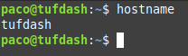</center>

### Adreça IP, Màscara, MAC i Adreça de broadcast

El comandament que emprarem en sistemes Linux per obtindre informació rellevant de la xarxa és ```ip a```. Amb aquest comandament obtindrem: adreça IP i màscara en format curt (etiqueta *inet*), Adreça MAC (etiqueta *link/ether*) i adreça de broadcast (etiqueta *brd*) de cadascun dels adaptadors de xarxa que tinguem instal·lats. L'adreça de la xarxa no ens la mostra, però com em vist en unitats anteriors, la podem obtindre realitzant l'operació **IP AND Màscara**.

A sistemes Windows, el comandament equivalent és ```ìpconfig /all```.

<center>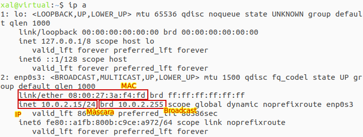</center>

### Porta d'enllaç

En Linux, la **porta d'enllaç** o **gateway** s'obtenen gràcies al comandament ```ip r```. La linia que indica la porta d'enllaç és la que està etiquetada com a *default*.

En sistemes windows, la porta d'enllaç ve indicada també amb el comandament ```ipconfig /all```.

<center>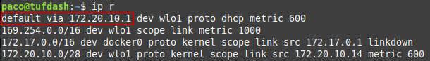</center>

### Servidors DNS

Per obtindre informació referent als servidors DNS configurats en sistemes Linux, haurem de consultar un fitxer mitjançant el comandament ```cat /etc/resolv.conf```. Si al fitxer ens diu que el nameserver és el 127.0.0.X significa que *NetworkManager* està configurat per iniciar una instància de la aplicació *dnsmasq* que és un servei local de reenviament de servidor de noms. Podem llavors, obtindre més infomació amb el comandament ```resolvectl status```.

Novament, a sistemes Windows, aquesta informació ens la donarà el comandament ```ìpconfig /all```.

### Informació del driver i de la connexió

A sistemes Linux, aquesta informació l'obtenim amb el comandament ```ethtool```:

- **Informacicó del driver**: ```ethtool -i <adaptador_xarxa>```
- **Informació de la connexió**: ```ethtool <adaptador_xarxa>```

### Conexions sense fils

A sistemes Linux, emprarem el camndament ```iwlist scan```per veure informació extra, el comandament ```iwconfig```. Sols mostrarà informació d'aquells adapatdors sense fils presents al sistema, evidentment.

## Test de velocitat de la xarxa local

***IPERF*** és una ferramenta que s'utilitza per fer proves de velocitat en xarxes. *Iperf* crea fluxes de dades TCP i/o UDP i realitza un informe amb marques de temps amb la quantitat de dades transmeses i el rendiment mig. Açò pot ser d'utilitat per **comparar la velocitat de les tomes d'equips de xarxa cablejats i sense fils** de forma imparcial.

Es tracta de *software* de codi obert i pot executar-se en diverses plataformes incloent Linux, Unix i Windows. Per instalar-lo en sistemes Debian (Ubuntu) hem d'executar ```sudo apt install iperf```.

*Iperf* pot funcionar com a **client (-c)** o com a **servidor (-s)** i pot mesurar el rendiment entre els dos extrems de la comunicació , unidireccional o bidireccionalment. Quan l'executem com a client (-c) hem d'afegir també l'adreça IP de l'equip que actua com a servidor (-s).

[Pàgina web del software Iperf](https://iperf.fr/)

<center>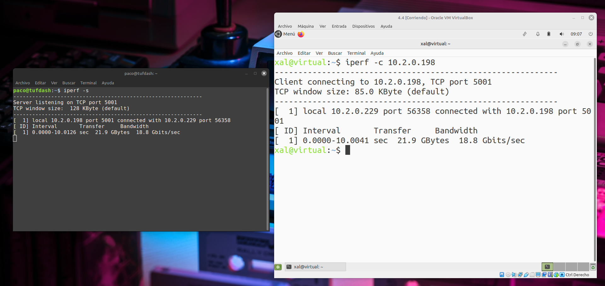</center>

## Adaptadors de xarxa en VirtualBox

Una màquina virtual (MV) en VirtualBox (VB) pot tenir fins a **8 targetes de xarxa PCI Ethernet**, i cadascuna d'elles, de manera independent, pot tenir assignat el tipus de hardware a virtualitzar i **el seu propi mode de configuració**. Des de l'administrador de VB es poden configurar 4 de les 8 targetes de xarxa, si ens feren falta més, hauriem de configurar-les per terminal mitjançant el programa ***VBoxManage***.

Per tal de configurar la xarxa del sistema virtualitzat, haurem de seleccionar la MV a la pantalla principal del VB i entrar en "Configuració" --> "Xarxa".

<center>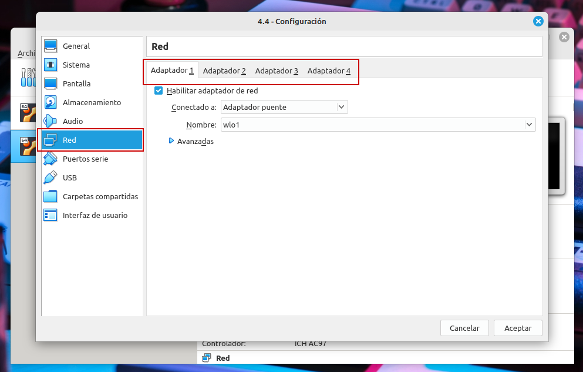{width=75%}</center>

Mitjançant el desplegable "Connectat a:" tindrem, en general, les següents opcions:

- **NAT**
- **Xarxa NAT**
- **Adaptador pont**
- **Adaptador sols-amfitrió**
- **Xarxa interna**
- **No connectat**

!!! info "Per a què serveix el protocol NAT?"
    
    **NAT** és un protocol que fou creat per traduir les IPs privades de la xarxa en una IP pública perquè la xarxa poguera enviar paquets a l'exterior; i traduir després eixa IP pública, de nou a la IP privada de l'equip que havia enviat el paquet, per tal que poguera rebre'l una vegada arribada la resposta.

    <center>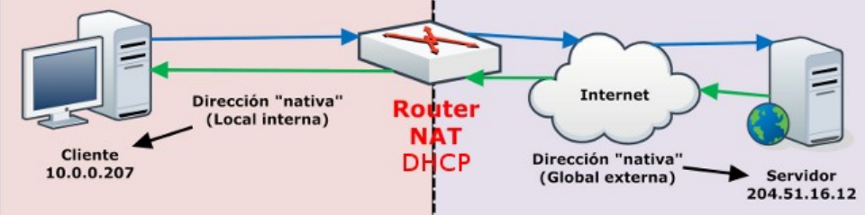{width=66%}</center>

### NAT en VirtualBox

A VB és el **mode per defecte** de la targeta de xarxa virtual. Amb aquesta opció el servei virtualitzat utilitza la targeta de xarxa de la ***màquina real (amfitrió)*** per navegar. En mode NAT, VB col·loca un ***router entre l'amfitrió (cap on fa NAT) i la màquina virtual***.

Aquest router poseeix un servidor DHCP que serveix cap a l'interior i mapeja el tràfic des de i cap a la MV de manera transparent. D'aquesta forma, si tenim configurat el client DHCP en el SO de la MV (opció habitualment per defecte), **en mode NAT tindrem Internet automàticament a la MV**.

**Cada MV en mode NAT** tindrà el seu propi router, per la qual cosa **estaran en xarxes aïllades**, el que implica que, per defecte, les MMVV que tenen la seua targeta en mode NAT **no poden veure's entre elles**.

L'adreça que el router (intern) serveix (DHCP) va a dependre del número de targeta de xarxa que estiga assignat en mode NAT. Les 8 targetes de xarxa que VB permet a cada MV van numerades del 0 al 7 i les adreces de xarxa dels routers segueixen el patró **10.0.[x + 2].0/24**, on x és el número de la targeta de xarxa (10.0.2.0/24, 10.0.3.0/24, ... , 10.0.9.0/24 ). L'adreça IP de la targeta de xarxa serà 10.0.x+2.**15**/24 i la porta d'enllaç (router intern) 10.0.x+2.**2**/24.

??? tip "Canvi d'adreçament NAT en VirtualBox"

    Pot ser interessant **canviar la numeració** motivats per el problema que estiguem resolent en un moment donat, i per fer-ho és necessari recòrrer al comandament ***VBoxManage*** de la següent forma:

    ```VBoxManage modifyvm "Nom_de_la_MV" --natnet1 192.168.0.0/16```

    Amb l'ordre anterior, l'adaptador de xarxa número 0 (--natnet1) de la MV "Nom_de_la_MV" pendrà l'adreça de xarxa 192.168.0.15/16 i la porta d'enllaç 192.168.0.2/16.

Un **desavantatge** d'aquest mode, com hem vist, és que **la MV és invisible i inalcaçable fora de la seua xarxa** i per tant, **no podem instal·lar un servidor d'aquesta manera, a no ser que configurem el reenviament de ports**. La qual cosa no està mal des del punt de vista de la seguretat.

??? tip "Reenviament de ports en xarxa NAT de VirtualBox"

    Si per exemple, a la MV col·loquem un servidor SSH i volem que les peticions SSH al port 2222 de l'amfitrió passen al port 22 del convidat (MV), on està el servidor SSH, redireccionarem els ports de la següent forma:

    ```VBoxManage modifyvm "Nom_de_la_MV" --natpf1 "servidorSSH, tcp,, 2222,, 22"```

    Al posar ***--natpf1***, estem dient que l'adaptador de xarxa 0 està en mode NAT i per ell rebrà les peticions el servidor SSH

    El nom ***servidorSSH*** és u nnom simbòlic que emprarem per gestionar aquesta redirecció, per exemple, si volem eliminar-la:

    ```VBoxManage modifyvm "Nom_de_la_MV" --natpf1 delete servidorSSH```

    En una redirecció on hem d'especificar les IPs, per exemple, **l'amfitrió té varies targetes i el convidatl'hem configurat de forma estàtica*** (a pesar que la targeta estiga en mode NAT i per tant es tinga un servidor DHCP), la IP de l'amfitrió va davant del port de l'amfitrió i la IP de convidat, davant del port del convidat:

    ```VBoxManage modifyvm "Nom_de_la_MV" --natpf1 "servidorSSH, tcp, 192.168.1.5, 2222, 10.0.2.50, 22"```

    El redireccionament de ports es pot fer també de forma gràfica mitjançant la secció de "Xarxa de la MV".

    <center>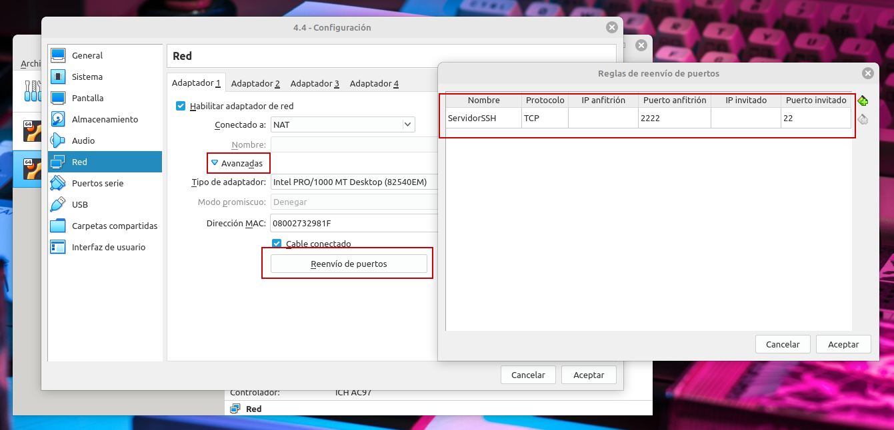{width=100%}</center>

!!! info "Per a què serveix el protocol DHCP?"
    
    - DHCP és un protocol que es **configura en servidors**.
    - Un servidor té un **llistat d'adreces IP dinàmiques i les va assignant** als clients conforme aquestes van quedant lliures, sabent en tot moment qui ha estat en posessií d'eixes IP, quan de temps la ha tingut i qui se li ha assignat després.
    - Així **els clients d'un xarxa IP poden aconseguir els seus paràmetres de configuració automàticament**.
    - Aquest protocol es va publicar en octubre de 1993 i la seua implementació actual està en RFC 2131.
    - Per a DHCPv6 es publica el RFC 331.
    - **VirtualBox permet configurar el servei DHCP en diverses modalitats: NAT, Xarxa Nat, Xarxa sols-amfitrió**.

### Xarxa NAT en VirtualBox

Funciona com el router de la nostra casa, és a dir, **els equips que estiguen dins de la mateixa Xarxa NAT podran comunicar-se entre ells, i esta és la diferència amb el mode NAT vist anteriorment, el qual sempre contruia una xarxa amb un únic equip i no de dicersos com ara és el cas.

<center>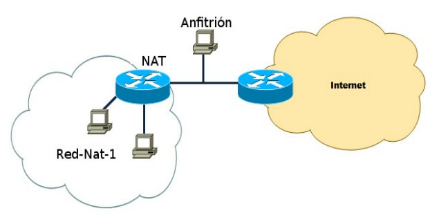{width=66%}</center>

#### Creació d'una xarxa NAT

Podem fer-ho de dues formes:

- Des de l'intèrpret de comandes escriure'm ```VBoxManage natnetwork add --netname CASA --network 192.168.0.0/24```.
- Des del menú del VB (les imatges corresponen a la versió 6 de VB): "Fitxer --> Preferències --> Xarxa"

<center>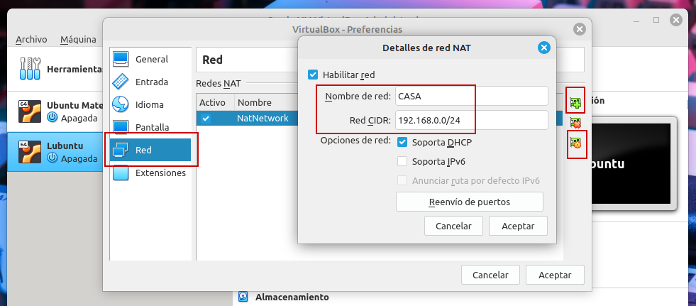{width=75%}</center>

Des de l'entorn gràfic podrem, també, configurar el **reenviament de ports**.

Podem **llistar la informació de les xarxaes NAT** disponibles i així comprovar els paràmetres que acabem de crear:

```VBoxManage list natnets```

Com podem veure, sols hi ha en aquest moment una única xarxa NAT anomenada **CASA** i podem destacar la següent informació:

<center>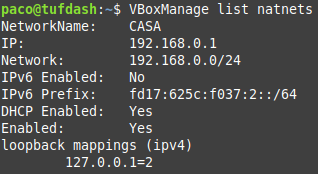{width=50%}</center>

El **servidor DHCP pot detindre's o activar-se** de manera independent, amb els següents comandaments:

```VBoxManage natnetwork modify --netname CASA --dhcp off```

```VBoxManage natnetwork modify --netname CASA --dhcp on```

**La xarxa NAT pot detindre's i seria com apagar el router**, és a dir, la xarxa quedaria sense eixida a l'exterior encara que tindria connexió entre els equips connectats a la mateixa xarxa NAT:

```VBoxManage natnetwork stop --netname CASA```

```VBoxManage natnetwork start --netname CASA```

Finalment, per **eliminar la xarxa NAT** executariem:

```VBoxManage natnetwork remove --netname CASA```

Aquestes opcions també **poden fer-se des de l'entonr gràfic de VB**.

### Adaptador pont en VirtualBox

El mode "Adaptador pont" **simula que la targeta virtual està connectada al mateix switch que la targeta física de l'amfitrió**, per tant, la MV va a comportar-se com si fòs un equip més dins de la mateixa xarxa física en la que està l'equip amfitrió. Així doncs, si l'amfitrió obté una adreça IP per DHCP, el host també la conseguirà. L'esquema de xarxa seria el següent:

<center>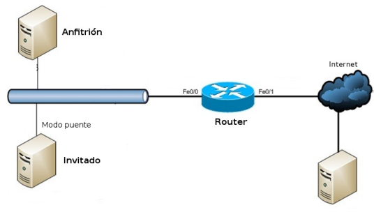{width=75%}</center>

!!! info "Com aconsegueix VB simular-ho?"
    Un **bridge** afig un nivell d'inteligència a una connexió entre xarxes. Connecta dos segments de xarxes iguals o distints. Podem veure un *bridge* com un classificador de correu que mira les adreces dels paquets i els col·loca a la **xarxa** adequada.

### Xarxa interna

Amb aquesta configuració de targetes de xarxa, podem contruir xarxes aïllades, en les quals **sols hi haurà communicació entre les MMVV que pertànyen a la mateixa xarxa interna**.

<center>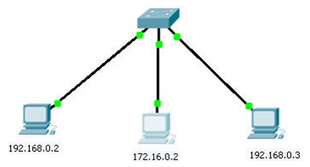{width=50%}</center>

**Per tal de connectar xarxes internes a l'exterior, haurem de crear MMVV que funcionen com *routers*** i disposen de dues targetes de xarxa, d'aquesta forma podrem contruir un camí cap a Internet. Aquesta màquina que funcionaria com a router, haurà de tindre alguna de les seues targetes en NAT o pont, per poder ixir físicament a l'*exterior*.

<center>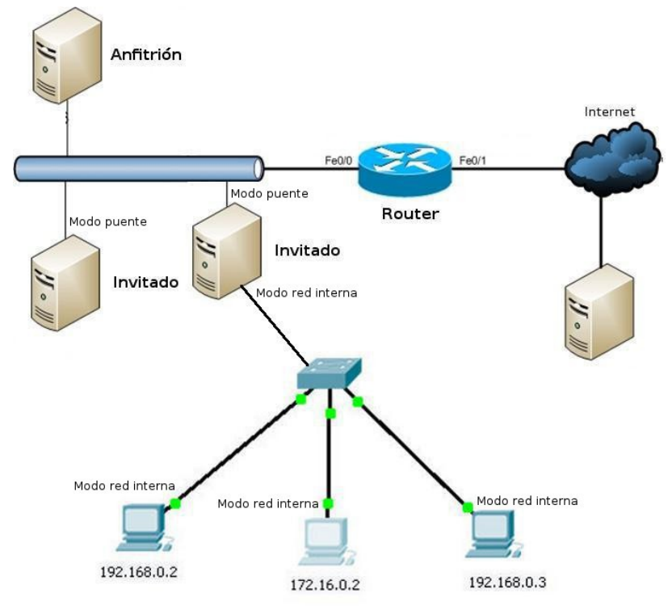{width=50%}</center>

Les xarxes internes de VB s'identifiquen a trevés d'un nom i **totes les MMVV que tinguen una targeta en mode xarxa interna amb el mateix nom formaran una única xarxa**. El nom de la xarxa interna s'especifica després de triar el mode; si no s'especifica, s'emprarà la xarxa interna per defecte de VB, anomenada ***intnet***.

<center>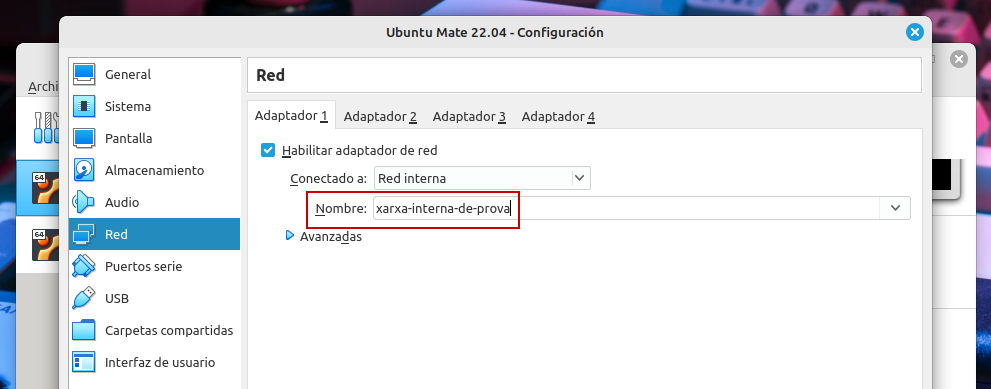{width=75%}</center>

### Adaptador sols-amfitrió

El mode "sols-amfitrió" s'empra per **crear un xarxa interna a la que pertanyerà també l'equip amfitrió, cosa que no succeeix al mode "xarxa interna"**.

!!! info "Justificació"
    
    La connexió directa en una mateixa xarxa, de l'amfitrió amb una o més MMVV, ha de fer-se emprant el "mode pont" el qual necessita per funcionar, que el cable físic de xarxa estiga connectat a la targeta de xarxa de l'amfitrió. En cas contrari, és com si estiguera apagat el switch que connecta a l'amfitrió amb les MMVV, i per tant, no existeix connexió entre elles, ni amb l'amfitrió. Si estiguéssem en una **situació en la qual no tinguérem connexió de xarxa**, no podriem treballa amb la configuració anterior; aquest **problema el resol el mode *sols-amfitrió***, doncs no empra la targeta física de la xarxa de l'amfitrió sino que es crea una virtual que estarà connectada al mateix switch virtual al que estaran connectades les targetes de xarxa de les MMVV amb el mateix mode de xarxa.

Per poder fer ús d'aquest mode, haurem de **crear la targeta de xarxa virtual a l'equip amfitrió**, per a tal cosa a l'administració de VB anirem a ***Fitxer -> Administrador de xarxa-amfitrió***.

<center>{width=75%}</center>

A partir d'aquest moment **existeixen tantes targetes noves de xarxa com creem**.

Aquestes targetes hi ha que **assignar-les una IP** de la xarxa que hàgem triat, i açòes fa configurant els camps del recuadre situat en la part inferior de la finestra. Ho farem seleccionant previament vboxnet0:

<center>{width=75%}</center>

També podrem activar un servidor DHCP per evitar configurar manualment les targetes de xarxa de les MMVV que es connecten...

??? bug "Error E_ACCESSDENIED"
    
    Algunes de les activitats i pràctiques proposades necessiten de la modificació de les xarxes ***sols anfitrió***, però podem trobar-nos davant errors al moment de configurar-ho com el següent:

    <center>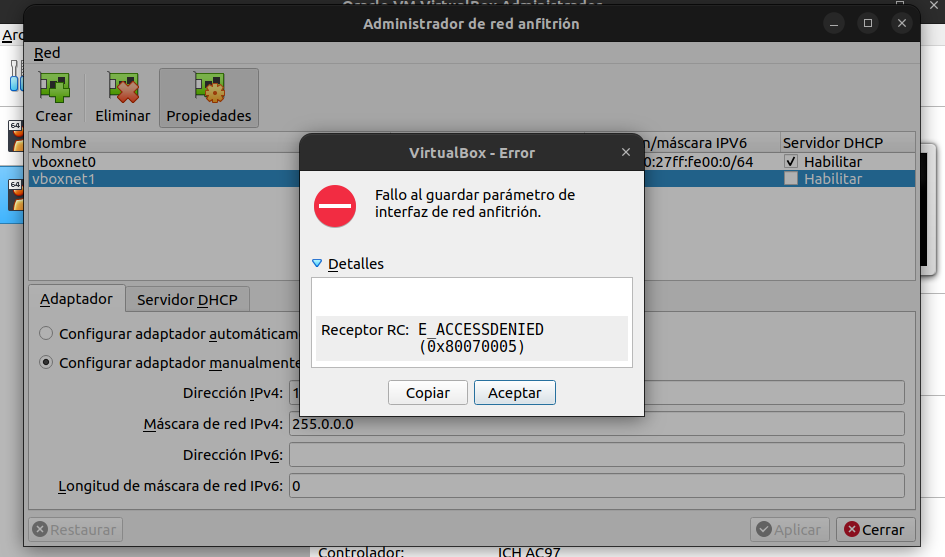{width=75%}</center>

    Aquest error es deu a que a partir de la versió 6.1.28 van afegir unes noves configuracions, que entre altres coses acoten el rang vàlid de xarxes disponibles per a xarxes ***sols anfitrió***.

    Açò desemboca en que sols s'accepten xarxes ***sols anfitrió*** en el rang 192.168.56.0/21.

    Per deshabilitar aquesta restricció, editarem el fitxer /etc/vbox/networks.conf (que pot no existir i haurem de crear-lo) i afegirem el rang

    ``` title=""
    * 0.0.0.0/0 ::/0
    ```

    que bàsicament habilita totes les xarxes. D'aquesta forma podrem emprar qualsevol xarxa en mode ***sols anfitrió***.

    <center>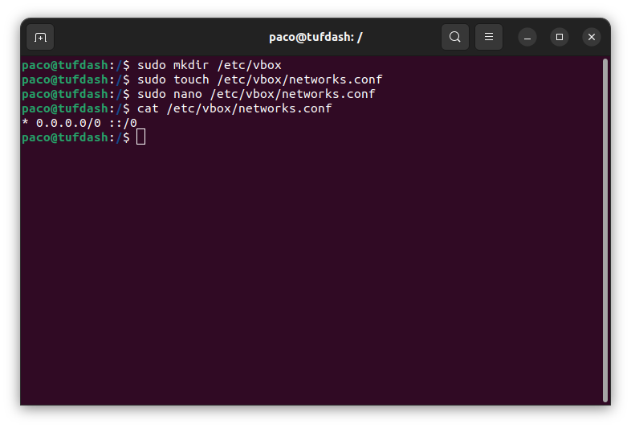{width=75%}</center>

    <center>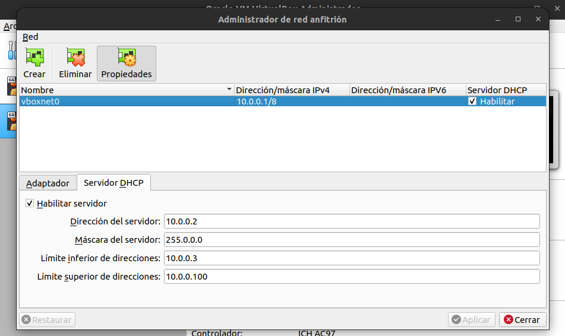{width=75%}</center>

## Netplan

Amb l'arribada d' **Ubuntu 18.04** arribàren canvis a la configuració dels serveis de xarxa.

<center>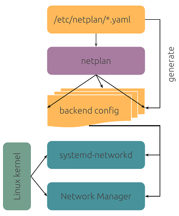{width=50%}</center>

A les versions anteriors, tota la configuració es realitzava per interfície gràfica o mitjançant fitxers de configuració, situats en **/etc/network**. A partir d'ara, tindrem les dues opcions, però els fitxers de configuració es troben a **/etc/netplan** i tenen extensió **yaml**.

<center>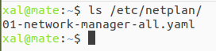</center>

Aquest fitxer és el que tindrem que modificar per tal d'aconseguir la configuració de xarxa que necessitem en cada cas.

<center>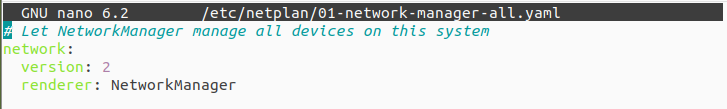</center>

Aquesta és la configuració per defecte de la xarxa. Amb aquesta configuració és la interfície gràfica l'encarregada de controlar tots els dispositius de la xarxa. Aquesta opció s'estableix a la linia: ```renderer: NetworkManager```.

A la majoria dels casos amb aquesta configuració tindrem suficient però no tindrem control sobre els dispossitius de la xarxa.

Per tal d'indicar que anem a ser nosaltres els qui definim el comportament i configuració de les interfícies de xarxa , haurem de modificar la linia anterior per: ```renderer: networkd```.

A partir d'aquest moment haurem d'especificar tota la informació necessària per al funcionament dels dispositius de xarxa.

Anem a veure diferents exemples de configuracións de **netplan**, aquests exemples són bàsics però suficients per poder realitzar exercicis.

!!! warning "Informació"
    Abans de veure els exemple, hi ha que tindre en compte que els fitxers en format **yaml** no acceptàven tabulacions al principi i per tal de realitzar les sangríes del text havíem d'emprar espais.

    A les versions més noves d'Ubuntu **el fitxers yaml ja suporten la tabulació**.
    

### Configurar targeta de xarxa per DHCP

``` yaml title=""
network:
  version: 2
  renderer: networkd
  ethernets:
    enp0s3:
      dhcp4: yes
```

On podem veure:

- ```renderer: networkd``` -- configurem nosaltres el dispositius de xarxa
- ```ethernets``` -- interfícies de xarxa a aconfigurar
- ```enp0s3``` -- nom de la interfície de xarxa a configurar
- ```dhcp4: yes``` -- DHCP activat

Aquest tipus de configuació la utilitzarem quan tinguem una targeta de xarxa sobre un adaptador de VirtualBox que accepte DHCP, és a dir, NAT, Xarxa NAT i Sols anfitrió.

### Configurar targeta de xarxa amb IP fixa

``` yaml title=""
network:
  version: 2
  renderer: networkd
  ethernets:
    enp0s3:
      addresses: [10.0.2.10/24]
      nameservers:
        addresses: [8.8.8.8, 8.8.4.4]
      routes:
        - to: default
          via: 10.0.2.2
```
A banda dels punts anteriors podem veure:

- ```addresses: [10.0.2.10/24]``` -- adreça de xarxa en format CIDR
- ```nameservers:``` -- a partir d'aquesta linia, configuració dels DNS.
- ```routes:``` -- gestió d'enrutament local, per exemple: porta d'enllaç (to: default - via...)

!!! warning "Gateway4 *deprecated*"    


    ``` yaml title=""
    network:
        version: 2
        renderer: networkd
        ethernets:
            enp0s3:
                address: [10.10.10.2/24]
                gateway4: 10.10.10.1
                nameservers:
                    addresses: [8.8.8.8, 8.8.4.4]
    ```

### Aplicar les configuracions

La modificació del fitxer ubicat en **/etc/netplan/** no implica que s'apliquen els canvis.  Cada vegada que modifiquem aquest fitxer **yaml** haurem de realitzar algunes accions:

- ```sudo netplan -debug try```: tracta d'aplicar la configuració que hem definit. Si no hi ha errades ixirà un contador per tornar a la configuració anterior o polsant ***ENTER*** aplicar la nova.
- ```sudo netplan apply```: aplica directament la configuració que hem definit. S'ha d'emprar en el cas d'estar completament segur que tot és correcte.

<center>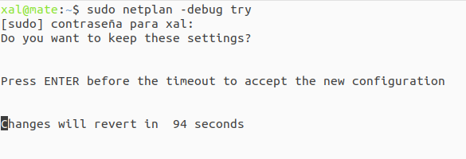</center>
